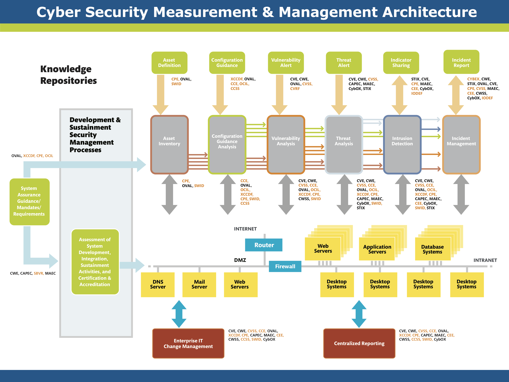
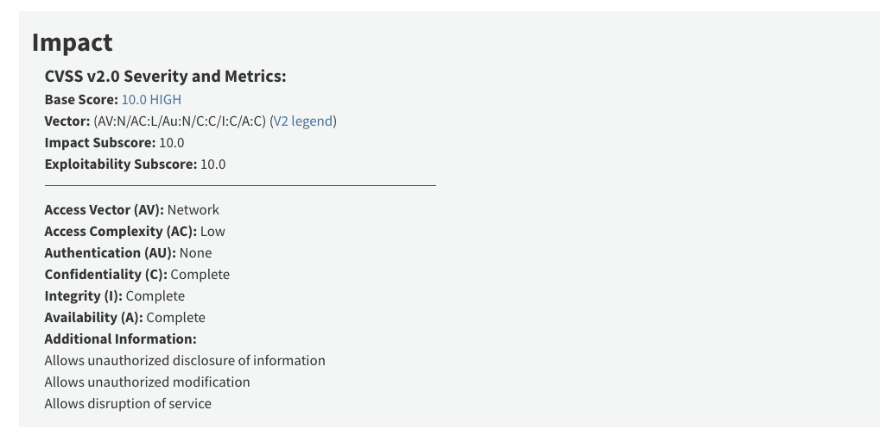
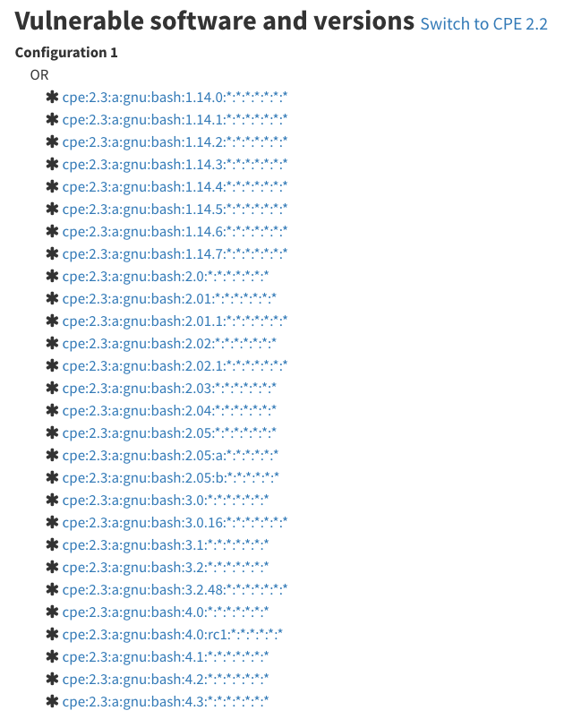
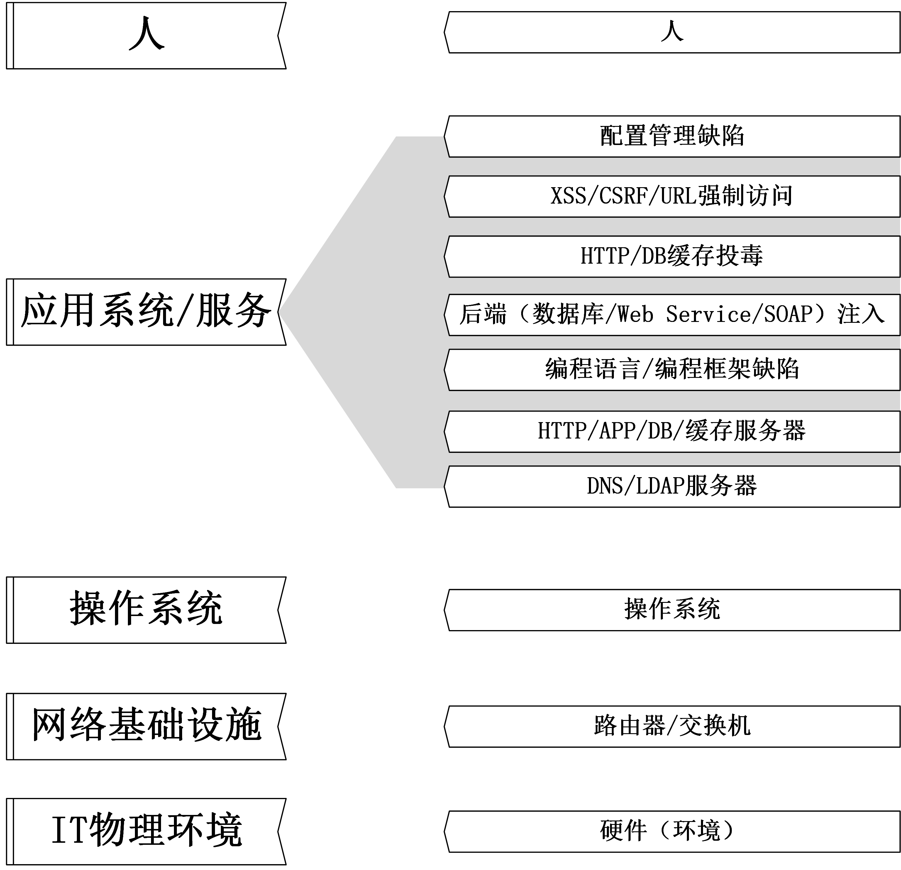
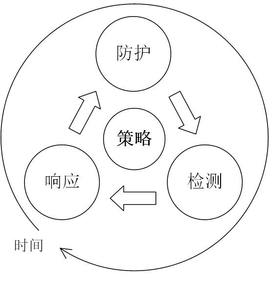
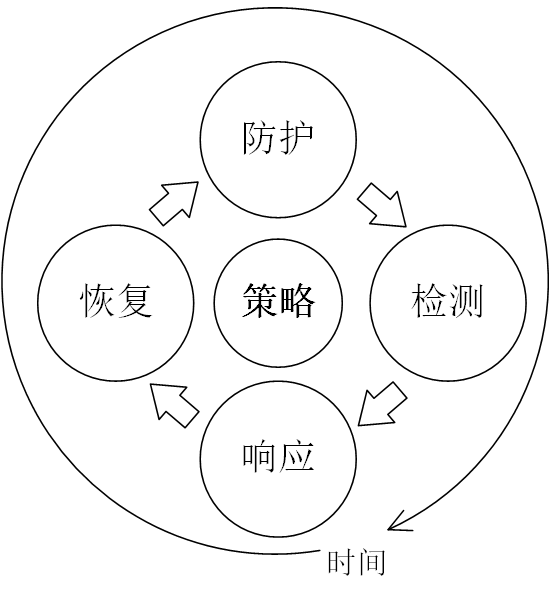

# 第一章 网络安全基础

## 1.1 专业术语定义

- 资产（Asset）

任何对组织业务具有价值的信息资产，包括计算机硬件、通信设施、IT 环境、数据库、软件、文档资料、信息服务和人员等。

- 网络安全（Cyberspace Security）

网络安全是指网络系统的硬件、软件及其系统中的数据受到保护，不因偶然的或者恶意的原因而遭到破坏、更改、泄露，系统连续可靠正常地运行，网络服务不中断的状态。从广义上说，网络安全包括网络硬件资源及信息资源的安全性。从用户角度看，网络安全主要是保障个人数据或企业的信息在网络中的机密性、完整性、可用性，防止信息的泄漏和破坏，防止信息资源的非授权访问。对于网络管理者来说，网络安全的主要任务是保障合法用户正常使用网络资源，避免病毒、拒绝服务、远程控制、非授权访问等安全威胁，及时发现安全漏洞，制止攻击行为等。从教育和意识形态方面，网络安全主要是保障信息内容的合法与健康，控制含不良内容的信息在网络中的传播。

- 安全属性

	- 机密性（Confidentiality）

    指网络中的保密信息只能供经过允许的人员，以经过允许的方式使用，信息不泄露给非授权用户、实体或过程，或供其利用，即信息不可见，状态不可知。“不可见”是机密性的基本要求，“不可感知”是机密性的更高要求。除了通信过程，信息存储与处理过程中同样存在机密性要求。

    一般来说，典型的机密性保护手段包括：数据加密与信息隐藏、数据隔离、通信流保护等。

	- 完整性（Integrity）

    完整性是指信息在存储或传输过程中不因种种不安全因素被偶然或蓄意的删除、修改、伪造、乱序、重放、插入、破坏和丢失而改变信息原有的内容、形式与流向的特性。完整性强调信息“未经授权不能进行更改”，保障信息的全面、精确与有效。

    - 可用性（Availability）

    可用性是指信息在需要的时候即可被使用，不因系统故障或误操作等使信息丢失或妨碍对信息的使用，是信息可被授权实体访问并按需使用的特性。

    影响信息可用性的典型因素大致分为硬件因素、软件因素、人员因素、环境因素几个方面。硬件因素例如磁盘故障导致数据不可用，服务器掉电导致服务不可用，网线被物理破坏导致的断网事件等直观因素；软件因素主要是指在规定时间内程序无法正常运行影响信息可用性，例如程序出错或崩溃导致服务中断；人员因素主要指人员无法成功完成工作或任务，例如管理员误删数据和服务内容，使用人员误操作导致系统出错；环境因素主要包括自然环境和电磁环境因素，例如停电、断网、地震、洪涝灾害等。

以上所讲的机密性、完整性、可用性是信息安全最基本属性，使用缩写 **CIA** 表示，也被称为 **“信息安全三要素”** 。

- 漏洞（Vulnerability）

漏洞又被称为脆弱性或弱点（Weakness），是指信息资产及其安全措施在安全方面的不足和弱点。漏洞一旦被利用，即会对资产造成影响。通常一个网络的漏洞/弱点可被分为：技术漏洞、配置漏洞和安全策略漏洞。

- 影响（Impact）

漏洞一旦被利用，会对资产造成影响。

- 威胁（Threat）

威胁即是一种可能破坏安全基本要素的来源或原因。按照威胁来源的不同，可以把威胁分类为：内部威胁、外部威胁、自然威胁和人为威胁。    

- 风险（Risk）

风险是指由于系统存在的脆弱性，人或自然威胁导致安全事件发生的可能性及其造成的影响。风险是威胁事件发生的可能性与影响综合作用的结果。当风险成为事实后，就会造成具体的影响，例如机密数据被窃、网页被篡改、网站被拒绝服务攻击所瘫痪等。

> Risk = Probability \* Damage Potential

- 风险管理（Risk Management）

风险管理是指风险管理者采取各种措施和方法，消灭或减少风险事件发生的各种可能性，或者减少风险事件发生时造成的损失。

常见的风险管理措施有风险降低、风险承受、风险规避、风险转移、分散风险五种。风险降低是指通过实施安全措施，把风险降低到一个可接受的级别；风险承受是指接受潜在的风险并继续运行信息系统；风险规避是指通过消除风险的原因或/和后果（如在发现风险后放弃系统某项功能或关闭系统）来规避风险，即不介入风险；风险转移是指通过使用其他措施来补偿损失，从而转移风险，如购买保险等；分散风险是指在异构化信息系统中，将重要的信息资产分散在多个异构系统中，提升关键数据泄露难度，降低风险。

- 残余风险（Residual Risk）

安全机制实施之后仍然遗留的风险。

- 事件（Event）

如果威胁主体能够产生威胁，利用资产及其安全措施的脆弱性，那么实际产生危害的情况称为事件。

- 安全需求（Security Requirement）

安全需求即信息系统安全建设需求。

- 攻击（Attack）

攻击是指由威胁源所实施的、导致安全事件发生的行为，它是 **漏洞利用** 和 **实现威胁** 的过程，一旦攻击得手即会造成影响。

- 安全策略（Security Policy）

安全策略是指在某个安全区域内，所有与安全活动相关的一套规则，它声明哪些行为是能做的、被允许的，哪些行为是不能做的、被禁止的。这些规则是由此安全区域中所设立的一个安全权利机构建立的，并由安全控制机构来描述、实施或实现的。

- 安全机制（Security Mechanism）

安全机制是一种用于解决和处理某种安全问题的方法，通常分为预防、检测和恢复三种类型。网络安全中绝大多数安全服务和安全机制都是建立在密码技术的基础之上的，它们通过密码学方法对数据信息进行加密和解密来实现网络安全的目标要求。

- 安全措施（Security Measure）

安全措施是安全策略和安全机制的统称。

## 1.2 威胁模型

所谓的网络安全威胁是指可能破坏某一网络资源的机密性、完整性以及可用性等安全基本要素的来源或原因。例如对于数据库中的数据来说， SQL 注入攻击就是一种网络威胁。一旦攻击得手，被攻击者就可能会被窃取机密数据从而导致数据的机密性被破坏。

使用 **威胁模型分析**(Threat Model Analysis, TMA) 可以帮助确定产品、应用程序、网络或环境中存在的风险和可能的攻击路径。TMA 的目标是确定哪些威胁需要缓解以及如何缓解。具体来说，威胁模型对于帮助企业应对安全威胁具有五个方面的具体作用：

1. 评估风险更加有效。传统的风险评估定级方法是按照通用的安全管理框架和标准（如 ISO 27001 ）进行操作，但实际结果存在发布的标准不适应新情况、规定的措施不够深入等问题，威胁模型分析可以弥补照搬安全行业标准进行管理所带来的缺陷。

2. 帮助深入理解企业系统。威胁模型的建立要求对企业内部的信息系统资产进行评估，对各个子系统之间的支持配合方式做深入详细的了解。使用威胁模型进行安全管理有助于深入理解整个企业系统。

3. 提高相关员工安全意识。在建立安全模型过程中，为深入了解系统功能和运行情况，需要与企业中的工作人员进行沟通，在此过程中有助于系统使用者树立起更好的安全意识，以便在以后的运维和管理工作中更加严谨和规范。

4. 安全管理措施次序优化。威胁模型可以帮助企业摒弃通用的、泛泛的管理措施，结合企业自身具体情况，着眼于可能面临的具体风险，选择合理的、有针对性的、有效的安全管理措施并优化其次序。

5. 提高安全管理效率。安全评估在时间上是受限的，因此必须把有限的时间集中在值得关注的点上。威胁模型可以让企业的安全管理人员更加透彻的理解各种攻击方式，从而明白真正具有威胁的攻击路径，避免无意义的时间消耗。

当前普遍采用的威胁模型包括：微软 STRIDE 模型、微软 DREAD 模型、卡耐基梅隆大学的 OCTAVE 模型等。威胁模型是多种多样的，但是建立过程却大致相同，基本上可以分为四个步骤，分别是：明确目标、分解系统、识别威胁、评估威胁。

### 1.2.1 微软 STRIDE 模型

| 威胁                              | 安全性属性 |
|-----------------------------------|------------|
| 假冒 (Spoof)                      | 认证       |
| 篡改 (Tamper)                     | 完整性     |
| 否认 (Repudiation)                | 不可抵赖性 |
| 信息泄露 (Information Disclosure) | 机密性     |
| 拒绝服务 (Denial of Service)      | 可用性     |
| 提升权限 (Elevation of Privilege) | 授权       |

从上表可以看出，STRIDE 模型正好是对应着安全属性而设计建模的，将威胁与提供威胁防护的特性相对照。

- **假冒**

当一个恶意用户假扮成一个信任实体进入系统，而计算机又不能区分时，这类安全威胁属于假冒，又称为身份欺诈；

- **篡改**

用户获得对一台计算机或某个系统的未经授权的访问权限，然后修改计算机或系统的操作、配置或数据，这种情况属于篡改。篡改可能是恶意的，也可能是无意的；

- **否认**

系统管理员或者安全代理不能证实一个用户（恶意用户或者其他用户）是否已经执行了某种操作，这种情况属于否认，也称为抵赖；

- **信息泄露**

未经授权的用户可以查看私有或保密数据；

- **拒绝服务**

拒绝服务威胁包括任何能够导致系统关闭或者组织访问计算机资源的攻击。拒绝服务攻击可能引起计算机应用程序或者操作系统停止运行、 CPU 忙于长时间无意义的计算、系统内存被消耗以至应用程序和造作系统的功能被削弱、网络带宽降低或者完全被扼杀等后果；

- **提升权限**

提升权限是指用户获得的访问权限超过系统管理员赋予他们的权限。权限提升给恶意用户发起其他任何类型安全威胁的攻击创造了机会。

#### 1.2.1.1 小提示

有一个经常被和【提升权限】混淆的威胁场景是【水平权限跨越】。例如，在电商的订单系统设计中，每个用户只能查看自己下的订单，禁止查看非本人订单详情。但在实际的订单系统实现时，往往会由于后台授权检查程序的 bug 导致订单详情信息被已登录用户任意查看。从权限级别的视角来看，每个用户的权限水平都是相同的，导致这个威胁的漏洞也并没有赋予攻击者更高权限，但对于系统的权限控制策略来说，攻击者确实提升了自己的查看权限等级，从效果上来说攻击者已经不是一个普通用户权限了，可能获得的是一个产品售后运营人员的权限子集。所以，水平权限跨越是一种漏洞类型的表现形式，但漏洞被利用之后的攻击效果确实属于提升权限，

### 1.2.2 DREAD 模型

DREAD 模型是由微软提出的，即潜在损失 **D**amage Potential 、可复现性 **R**eproducibility 、可利用性 **E**xploitability 、受影响的用户 **A**ffected users 、可发现性 **D**iscoverability 。由于简单的评价系统通常存在小组成员对评价结果意见不统一的问题，为帮助解决这个问题， DREAD模型通过询问下列问题得到给定威胁的风险评价结果：

- 潜在损失：如果缺陷被利用，损失有多大？
- 可复现性：重复产生攻击的难度有多大？
- 可利用性：发起攻击的难度有多大？
- 受影响的用户：用粗略的百分数表示，有多少用户受到影响？
- 可发现性：缺陷容易发现吗？

在 DREAD 模型里，每一个因素都可以分为高、中、低三个等级，通过赋予不同的权值，我们可以具体计算出某一个威胁的风险值。

| 评价                 | 高                               | 中                                             | 低                       |
|----------------------|----------------------------------|------------------------------------------------|--------------------------|
| 潜在损失（Damage potential） | 获取完整验证权限；执行管理员操作；非法上传文件；                    | 泄漏敏感信息；                                 | 泄漏其他信息；           |
| 可复现性（Reproducibility）  | 攻击者可以随意再次攻击；         | 攻击者可以重复攻击，但是有时间限制；           | 攻击者很难重复攻击过程； |
| 可利用性（Exploitability）   | 初学者可以在短期内掌握攻击方法； | 熟练的攻击者才能实现完整攻击；                 | 漏洞利用条件非常苛刻；   |
| 受影响的用户（Affected users）   | 所有用户，默认配置，关键用户；   | 部分用户，非默认配置；                         | 极少数用户，匿名用户；   |
| 可发现性（Discoverability）  | 漏洞很明显，攻击条件很容易获得； | 私有区域且仅部分人能够看见，需要深入挖掘漏洞； | 发现该漏洞极其困难；     |

使用 DREAD 评估模型存在几点不足：1）不支持面向对象设计方法；2）不利于捕捉控制流中存在的威胁；3）DREAD 方法不能反应不同攻击路径的成本效益差异。

### 1.2.3 OCTAVE 模型

可操作的关键威胁、资产和薄弱点评估（Operationally Critical Treat, and Vulnerability Evaluation）是由美国卡耐基·梅隆大学软件工程研究所下属的 CERT 协调中心于 1999 年开发的用以定义一种系统的、组织范围内的评估信息安全风险的方法，是一种自主型信息安全风险评估方法。OCTAVE 方法是 Alberts 和 Dorofee 共同研究的成果，它是一种从系统的、组织的角度开发的新型信息安全保护方法，主要针对大型组织，中小型组织也可以对其适当剪裁，以满足自身需要。

OCTAVE 实施分为三个阶段：

- **建立基于资产的威胁配置文件（Threat Profile）**

从组织的角度进行评估，组织的全体员工阐述他们的看法，如什么对组织重要（与信息相关的资产），应当采取什么样的措施保护这些资产等。分析团队整理这些信息，确定对组织最重要的资产（关键资产）并标识对这些资产的威胁；

- **标识基础结构的弱点对计算基础结构进行评估**

分析团队标识出与每种关键资产相关的关键信息技术和组件，然后对这些关键组件进行分析，找出导致对关键资产产生未授权行为的弱点（技术弱点）；

- **开发安全策略和计划**

分析团队标识出组织关键资产的风险，并确定要采取的措施。根据对收集到的信息所做的分析，为组织开发保护策略和缓和计划，以解决关键资产的风险。

## 1.3 漏洞管理相关标准

漏洞标准是关于漏洞命名、评级、检测、管理的一系列规则和规范，是信息安全保障体系的重要组成部分，是对漏洞进行合理、有效管控的重要手段，为信息安全测评和风险评估提供了基础。

美国的安全研究机构与组织先后推出了一系列有影响力的标准，其中，CVE 、CVSS 等 7 个标准已被国际电信联盟（ITU）的电信标准化部门（ITU-T）纳入到了其 X 系列（数据网、开放系统通信和安全性）建议书中，成为了 ITU-T 推荐的国际漏洞标准。如下表格列出了这 7 个标准及其建议书编号：

| 漏洞标准 | 英文全称 | 中文名称 | 建议书编号 |
|----------|----------|---------|----------|
| CVE   | Common Vulnerability and Exposure | 通用漏洞及曝光 | [ITU-T X.1520](https://www.itu.int/ITU-T/recommendations/rec.aspx?rec=11061) |
| CVSS  | Common Vulnerability Scoring System | 通用漏洞评分系统 | [ITU-T X.1521](https://www.itu.int/rec/T-REC-X.1521/en) |
| CWE   | Common Weakness Enumeration | 通用缺陷枚举 | [ITU-T X.1524](https://www.itu.int/rec/T-REC-X.1524/en) |
| CWSS  | Common Weakness Scoring System | 通用缺陷评分系统 | [ITU-T X.1525](https://www.itu.int/rec/T-REC-X.1525/en) |
| CPE   | Common Platform Enumeration | 通用平台枚举 | [ITU-T X.1528](https://www.itu.int/rec/T-REC-X.1528/en) |
| OVAL  | Open Vulnerability and Assesment Language | 开放漏洞评估语言 | [ITU-T X.1526](https://www.itu.int/rec/T-REC-X.1526/en) |
| CAPEC | Common Attack Pattern Enumeration and Classification   | 常见攻击模式枚举和分类 | [ITU-T X.1544](https://www.itu.int/rec/T-REC-X.1544/en) |

为了实现「可度量的安全」和「可执行的安全」标准，除了上述 7 个标准之外还有一些相关安全标准被设计提出。例如：威胁情报领域的威胁情报交换格式标准 [STIX](https://oasis-open.github.io/cti-documentation/stix/intro.html) 、恶意软件分类和特征标准 [MAEC](https://maecproject.github.io/) 和可扩展配置检查清单描述标准 [XCCDF](https://csrc.nist.gov/projects/security-content-automation-protocol/scap-specifications/xccdf) 等。这些标准在公布之后并非一成不变，有些标准在发展的过程中被整合到其他相关标准之中。例如：CybOX 就已经被整合到了 STIX 2.0 标准之中。

借用这些标准的主要制定者 [mitre.org](https://measurablesecurity.mitre.org/docs/Cyber_Security_Measurement_and_Management_Poster.pdf) 的一张图来概括这些标准在「安全测量」和「安全管理」架构中所扮演的角色，如下图所示：

国际电信联盟在 2011 年的一个技术会议上对上述安全标准之间的关系做了一个 [更为精简的总结](https://www.itu.int/en/ITU-T/studygroups/com17/Documents/tutorials/2011/SCE-2011-8-26.pdf) ，如下图所示：

### 1.3.1 CVSS

通用弱点评价体系（Common Vulnerability Scoring System, CVSS）是由美国国土安全部主导的 NIAC（国家资讯与分析中心）开发、FIRST（Forum of Incident Response and Security Teams，事件反应和安全小组论坛）维护的一个开放并且能够被产品厂商免费采用的标准。利用该标准，可以对弱点进行评分，进而帮助我们判断修复不同弱点的优点等级。

CVSS 威胁评分层次：

- 基本评分

基本评分是根据漏洞本身固有特性所可能造成的影响评价得到的分值；

- 生命周期因素修正

生命周期因素修正就是基于时间进程的修正，需要跟踪每个漏洞的补丁发布情况，工作量较大；

- 环境因素修正

环境因素即是基于部署情况的修正，其取决于组织受漏洞影响的产品部署情况。

| CVSS分值 | 0        | 1-3     | 4-6      | 7-10     |
|----------|----------|---------|----------|----------|
| 优先级   | P1       | P2      | P3       | P4       |
| 补丁SLA(Service Level Agreement)  | 自由决定 | 3-6 个月 | 最多四周 | 最多两周 |

在 [第二章](../chap0x02/main.md) 中，我们将详细介绍CVSS的具体内容。

### 1.3.2 CVE

``CVE`` 的全称是 ``Common Vulnerabilities & Exposures`` ，中文翻译对应「公共漏洞曝光」。 CVE 就好像是一个字典表，为广泛认同的信息安全漏洞或者已经暴露出来的弱点给出一个公共的名称。使用一个共同的名字，可以帮助用户在各自独立的各种漏洞数据库中和漏洞评估工具中共享数据，虽然这些工具很难整合在一起。这样就使得 CVE 成为了安全信息共享的“关键字”。CVE 开始建立是在 1999 年 9 月，起初只有 321 个条目。在 2000 年 10 月 16 日，CVE 达到了一个重要的里程碑——超过 1000 个正式条目。截止 2018 年 4 月 25 日，CVE 共计收录了  [100053](https://cve.mitre.org/cve/) 个正式漏洞。

CVE 目前已经是信息安全界内有关漏洞的一个人事实上的标准，安全研究人员也把自己发现的漏洞能够具备 CVE-ID 编号为荣。但需要注意的是，**并不是所有发现的安全漏洞都能获得 CVE-ID** ，申请 CVE-ID 有一个严格的流程。

CVE 开始是由 [MITRE Corporation](https://www.mitre.org/) 负责日常工作的，但是随着涉及的漏洞范围愈发广泛，漏洞在首次公开时就需要一个 CVE-ID 来规范其唯一性，[CNA（CVE Numbering Authority）](https://cve.mitre.org/cve/cna.html) 就是一个向研究人员和信息技术厂商在首次披露新漏洞时分发 CVE-ID编号的机构。而 MITRE 现在已经不直接参与具体漏洞的细节。按照按需分配的原则，MITRE 向每一个 CNA 成员分配一个 CVE-ID 编号池供其分发漏洞编号。根据 [CVE 官网 Request CVE IDs](https://cve.mitre.org/cve/request_id.html) 页面（包括 CNA 成员列表和 CNA 成员类型详细说明）的说明：CVE 优先为 CNA 成员相关的产品漏洞分配 CVE-ID，对于非 CNA 成员相关的产品漏洞需要联系 ``Primary CNA`` （目前只有 ``MITRE Corporation`` 自己）报告漏洞和申请对应漏洞编号。

CVE-ID 编号预订流程允许负责任的研究人员，供应商和事件响应团队在漏洞最初的公告中就可以包含一个 CVE-ID 编号， 以确保这个 CVE-ID 编号可以立即提供给所有用户，使得可以方便地实时跟踪漏洞。其基本流程是：

1. 发起一个或多个对 CVE-ID 编号的请求；
2. MITRE 保留并向请求者提供这些 CVE-ID 编号；并在 CVE 网站创建跟这些 CVE-ID 编号有关的无内容的“空白”页面；
3. 请求者将这些 CVE-ID 编号与漏洞信息披露的各方分享；
4. 请求者在漏洞的建议中会包含这些 CVE-ID 编号；
5. 请求者公开 CVE-ID 编号并通知 MITRE；
6. MITRE 在 CVE 网站上提供漏洞细节以更新跟这些 CVE-ID 编号有关的漏洞；
7. 如果该 CVE-ID 的问题一直保留没有公开，该 CVE-ID 将被删除，而且不会再会指派给其他的漏洞，即该 CVE-ID 将会彻底消失；

### 1.3.3 CNVD

[国家信息安全漏洞共享平台（China National Vulnerability Database，简称CNVD）](http://www.cnvd.org.cn/webinfo/list?type=7) 是由国家计算机网络应急技术处理协调中心（中文简称国家互联应急中心，英文简称 CNCERT ）联合国内重要信息系统单位、基础电信运营商、网络安全厂商、软件厂商和互联网企业建立的信息安全漏洞信息共享知识库。

建立 CNVD 的主要目标即与国家政府部门、重要信息系统用户、运营商、主要安全厂商、软件厂商、科研机构、公共互联网用户等共同建立软件安全漏洞统一收集验证、预警发布及应急处置体系，切实提升我国在安全漏洞方面的整体研究水平和及时预防能力，进而提高我国信息系统及国产软件的安全性，带动国内相关安全产品的发展。由 CNVD 牵头制订的 [中国互联网协会漏洞信息披露和处置自律公约](http://www.cnvd.org.cn/gy) 是安全研究人员和组织在发现漏洞后应遵守和执行的一个重要指导原则。

NVD（National Vulnerability Database）是美国的国家漏洞数据库，其角色和作用同我国的 CNVD。

### 1.3.4 CWE

[常见缺陷列表（Common Weakness Enumeration, CWE）](http://cwe.mitre.org/about/index.html)是对常见软件缺陷和漏洞进行分类整理的一套标准，该标准的制订目标是归纳和整理不同的软件缺陷机理，统一软件安全漏洞（包括架构、设计或代码实现层面）的描述语言以便于开发出自动化工具来识别、修复和预防这些缺陷。

无论 CVSS ，还是 CVE 、CWE ，其基本目标都是围绕创建可度量的安全（标准）。

### 1.3.5 以「破壳」漏洞为例

2014 年 9 月 24 日 GNU Bash 被公布存在远程代码执行漏洞，并在接下来的几天时间里先后出现了「官方发布漏洞补丁」、「补丁被绕过，发现新漏洞」、「新漏洞再被补丁」、「新补丁再次被绕过，发现新漏洞」……  此次安全事件之后，相关 6 个有 CVE 编号的 Bash 漏洞被业界统称为「Shellshock」（中文译名：「破壳」）漏洞。「破壳」漏洞对应的第一个 CVE 漏洞编号为 CVE-2014-6271，以其在 [NVD 的漏洞详情页](https://nvd.nist.gov/vuln/detail/CVE-2014-6271) 为例，我们小结一下上述几个漏洞管理相关的标准之间的关系。

图 1-3 说明了，该漏洞的信息来源于 ``MITRE``，对应的 CVE 编号为 ``CVE-2014-6271``。

图 1-4 说明了该漏洞的危害性评分采用的是 ``CVSS v2.0`` 标准以及具体的评分信息（总分为 10.0，危害评级为 ``高``）。

图 1-5 给出了该漏洞的机理用 ``CWE`` 标准进行归类对应「漏洞成因类型」编号：``CWE-78 操作系统命令注入``。

图 1-6 说明了存在该漏洞的软件运行环境信息用 ``CPE`` 标准进行描述包括哪些「环境组合」。

另外，根据 [卢森博格计算机应急响应中心，Computer Incident Response Center Luxembourg (CIRCL) ](https://cve.circl.lu/cve/CVE-2014-6271) 的漏洞数据库信息，我们可以看到 ``CVE-2014-6271`` 的 ``漏洞利用方式`` 如果采用 ``CAPEC`` 去描述，一共包括了 5 种攻击方法（漏洞利用方式）：

* [CAPEC-108](https://cve.circl.lu/capec/108) ：通过 SQL 注入实现命令行执行（Command Line Execution through SQL Injection）
* [CAPEC-15](https://cve.circl.lu/capec/15) ：命令分隔符（Command Delimiters）
* [CAPEC-43](https://cve.circl.lu/capec/43) ：多层输入解释器漏洞利用（Exploiting Multiple Input Interpretation Layers）
* [CAPEC-6](https://cve.circl.lu/capec/6) ：参数注入（Argument Injection）
* [CAPEC-88](https://cve.circl.lu/capec/88) ：操作系统命令注入（OS Command Injection）

这个例子很好的说明了 ``CVE``、``CWE`` 和 ``CAPEC`` 之间的关系：

* ``CVE`` 是针对「具体软件」的「具体版本」的一次「漏洞曝光」，``CWE`` 针对「具体软件无关」的「具体类型漏洞机理」。
* ``CVE`` 可以对「已发布软件」的已知漏洞统一指代和描述，``CWE`` 可以指导「开发中的软件」规避已知安全漏洞，``CAPCE``则可以指导对「测试中的软件」进行实战方式的渗透测试。
* ``CWE`` 关注的「漏洞成因」，``CAPEC`` 关注「漏洞被利用实现攻击的具体方式」。以 ``CVE-2014-6271`` 为例，虽然漏洞成因只有一个，但漏洞的实际利用方式不止一种，具体的利用方式实例包括：Apache服务器使用 mod_cgi 或者 mod_cgid ，如果 CGI 脚本在 BASH 或者运行在子 Shell 里都会受影响；DHCP 客户端调用 Shell 脚本接收远程恶意服务器的环境变量参数值的情况会被此漏洞利用；任何其他程序执行 Shell 脚本时用 Bash 作为解释器都可能受影响等。

除此之外，在上述漏洞信息数据库中还给出了该漏洞的 ``OVAL`` 描述。

## 1.4 安全策略和安全机制

安全策略和安全机制统称为安全措施，它是对抗威胁，减小脆弱性，保护资产，降低意外事件的影响，检测、响应意外事件，促进灾难恢复和打击信息犯罪而实施的各种实践、规程和机制的总称。

### 1.4.1 信任和安全假设

以“打开一扇门需要一把钥匙”作为前提，门锁系统安全为要求，系统的安全假设、安全需求、实际环境和信任分别对应为：

- 安全假设：门锁不会被开锁匠用工具打开；
- 安全需求：只有通过匹配的钥匙才能打开这扇门；
- 实际环境：技术高超的开锁匠可以在没有钥匙的情况下用自制工具打开门锁；
- 信任：如果锁匠是可信的，上述安全假设可以成立。

**定义1** 所谓**信任**是在特定时段特定上下文环境中服务授信方（Trustor）对受信方（Trustee）的诚信（honesty）、安全性（security）、可靠性（realiblity）和性能（competence）的一种主观肯定。

**定义2 信任度**（trust degree）则是授信方对受信方信任程度的量化表示，也称为信任值、可信度。

根据信任的获取方式，信任可分为直接信任和间接推荐信任两类：

**定义3 直接信任**是根据实体间直接交互的经验，在特定环境中和特定时间内，对目标实体未来行为的主观期望。

**定义4** **间接推荐信任**是指通过中间实体推荐而获得的对目标实体的综合期望值。在进行信任决策时，当两个实体间过去没有直接的交互或交互经验较少时，往往可借助对方的间接推荐信任来抉择。

在上述实例中，“信任”的内涵包括：

- 开锁匠是可信的：在没有获得门锁主人的授权的前提条件下，开锁匠不会去“开锁”；
- 门锁的“后门”是可信的：“后门”不会被不可信的人发现，更不会被恶意利用，然而一旦信任不再，基于信任的安全机制将会失去效果；
- 开锁匠非授权利用门锁的“后门”，在没有得到门锁主人授权的前提条件下，不使用钥匙也打开了门。

### 1.4.2 安全策略（Security Policy）

**安全策略**是指在某个安全区域内，所有与安全活动相关的一套规则。安全策略包括一些过程用于检测、阻止和应对安全事件，它为安全计划和应用程序的过程提供一个框架，它声明哪些行为是能做的、被允许的，哪些行为是不能做的、被禁止的。这些规则是由此安全区域中所设立的一个安全权利机构建立的，并由安全控制机构来描述、实施或实现的。

网络安全策略包括对企业的各种网络服务的安全层次和用户的权限进行分类，确定管理员的安全职责，如何实施安全故障处理、网络拓扑结构、入侵和攻击的防御和检测、备份和灾难恢复等内容。*（在本书中我们所说的安全策略主要涉及物理安全策略、访问控制策略、信息加密策略和安全管理策略等方面。）*

在安全策略中存在如下**安全假设**：

- 系统的状态能被正确、无歧义的分为“安全”和“不安全”两种状态，例如某银行的安全策略规定为“银行经理进行转账操作时被授权的”；
- 安全机制能够强制保证系统不会进入“不安全”状态。

如果以上2个安全假设中的任意一个为假，则系统的安全性无法得到保证。但现实生活中常常因为定义的安全策略不严格导致错误的定义了系统的“安全”状态。例如对于上述银行制定的安全策略，如果银行经理把他人账户里的钱转到自己账户下，虽然满足制定的安全策略但是仍然是非法的。

### 1.4.3 安全机制（Security Mechanism）

安全机制是一种用于解决和处理某种安全问题的方法，通常分为预防、检测和恢复三种类型。网络安全中绝大多数安全服务和安全机制都是建立在密码技术的基础之上的，它们通过密码学方法对数据信息进行加密和解密来实现网络安全的目标要求。

一个或多个安全机制的运用与实现便构成一种安全策略。在网络安全中，常把密码函数运用到安全策略中的某个环节上，通过数据加密可以把需要保护的敏感数据的敏感性减弱，从而降低危险。

安全机制符号定义：

- P ：实施安全机制前系统所有的可能状态；
- Q ：系统所有的安全状态（由安全策略定义）；
- R ：实施安全机制后系统所有的可能状态。

安全机制的三种等级：

- 安全：R ⊆ Q
- 精确：R = Q
- 宽泛：r ∈ R ∧ r ∉ Q

但我们需要明确的是“绝对的安全”是不存在的，安全都是“相对”的，其含义包括：

- 时间：随着时间的推移，原有的安全机制会逐渐失效；
- 威胁：对特定威胁（对手），安全机制会失效。

在安全机制中存在如下 **安全假设**：

- 每一个安全机制都是被设计用来实现安全策略中的一个或多个具体策略；
- 安全策略的集合能够实现所有的安全策略；
- 安全机制的实现是正确的；
- 安全机制的部署和管理是正确的。

## 1.5 计算机网络安全模型

所谓网络安全模型，就是动态网络安全过程的抽象描述。通过对安全模型的研究，了解安全动态过程的构成因素，是构建合理而实用的安全策略体系的前提之一。为了达到安全防范的目标，需要建立合理的网络安全模型描述、以指导网络安全工作的部署和管理。目前，在网络安全领域存有较多的网络安全模型，这些安全模型都较好地描述了网络安全的部分特征，又有各自的侧重点，在各自不同的专业和领域都有着一定程度的应用。

### 1.5.1 静态模型——安全威胁的分层模型

ISO/OSI（International Organization for Standardization/Open System Interconnect）是国际标准组织 1978 年制定的开放系统互联模型。这个模型把网络分为 7 层，分别是物理层、数据层链路层、网络层、传输层、会话层、表示层和应用层。TCP/IP 是 ISO/OSI 的简化模型，它将 7 层模型简化为 5 层，分别为应用层、传输层、网络层、网络链路层和物理层。

将 Web 威胁模型与计算机网络分层的方法相结合：

安全威胁的分层模型和计算机网络的分层模型类似：

- 每一层的安全威胁是既相互独立，又相互联系、相互影响的；
- 每一层的安全威胁必须依靠当前层的安全策略和安全机制解决；
- 下一层的安全机制是上一层安全机制的基础；
- 上一层的安全机制等级不会高于下一层的安全机制等级；
- 下层不安全，上层的安全无法保障；下层安全，并不代表上层安全。

### 1.5.2 动态模型—— P2DR 模型

P2DR 模型是美国国际互联网安全系统公司 ISS 最先提出的，即策略（Policy）、防护（Protection）、检测（Detection）、响应（Response）。

P2DR 模型是建立在基于时间的安全理论基础之上的，按照 P2DR 的观点，一个完整的动态安全体系，不仅需要恰当的防护（如操作系统访问控制、防火墙、加密等），而且需要动态的检测机制（如入侵检测、漏洞扫描等），在发现问题时还需要及时响应，这样的体系需要在统一的、一致的安全策略指导下实施，形成一个完备的、闭环的动态自适应安全体系。

1)  **策略**。策略是 P2DR 安全模型的核心，所有的防护、检测和响应都是依据安全策略实施的，安全策略为安全管理提供管理方向和支持手段。策略体系的建立包括安全策略的制定、评估和执行等，制定可行的安全策略取决于对网络信息系统的了解程度。网络安全策略一般包括总体安全策略和具体安全策略两个组成部分；

2) **防护**。防护是根据系统可能出现的安全问题而采取的预防措施，以保护信息系统的保密性、完整性、可用性、可控性和不可否认性，并根据不同等级的系统安全要求来完善系统的安全功能和安全机制。这些措施通过传统的静态安全技术实现。采用的防护技术通常包括：

* 主动防护。例如：数据加密、身份认证、访问控制、虚拟专用网 VPN 等；
* 被动防护。例如：防火墙、安全扫描、入侵检测。

3) **检测**

检测是动态响应的依据，利用检测工具来了解和评估系统的安全状态，是强制落实安全策略的工具，通过不断地检测和监控网络和系统，来发现新的威胁和弱点，通过循环反馈来及时作出有效的响应。网络的安全风险是实时存在的，检测的对象主要针对系统自身的脆弱性及外部威胁。检测的内容主要包括：检查系统存在的脆弱性；在主机系统运行过程中检查或测试是否产生漏洞、系统是否遭到入侵，并找到漏洞的原因和攻击的来源。*，如计算机网络入侵检测、信息传输检查、电子邮件监视、电磁泄漏辐射检测、屏蔽效果测试、磁介质消磁效果验证等。*

安全检测的方法主要有：

* 安全测试
* 蜜罐
* 入侵检测
* 安全审计

4) **响应**

从某种意义上来讲，安全问题就是要解决紧急响应和异常处理问题，通过建立反应机制以提高实时性，形成快速响应的能力。在检测到安全防护措施正在遭受攻击或已经失效（安全机制被突破），安全响应机制/系统必须及时做出正确的响应从而把系统调整到安全状态，对于危及安全的事件、行为、过程，需要及时作出处理，杜绝危害进一步扩大，使系统力求提供正常的服务。较常采用的响应措施有：

* 产生警告
* 限制访问
* 灾难恢复
* 启用备用系统

P2DR 模型是在整体的安全策略的控制和指导下，在综合运用如防火墙、操作系统身份认证、加密等防护手段的同时，利用如漏洞评估、入侵检测等检测工具了解和评估系统的安全状态，并通过适当的反应将系统调整到“最安全”和“风险最低”的状态。防护、检测和响应组成了一个完整的、动态的安全循环，在安全策略的指导下保证信息系统的安全。该理论的最基本原理就是认为，信息安全相关的所有活动，不论是攻击行为、防护行为、检测行为还是响应行为等都需要消耗时间，因此可以通过时间来衡量一个体系的安全性和安全能力。

作为一个防护体系，当入侵者要发起攻击时，每一步都需要花费时间：

* Pt ：攻击成功花费的时间，即安全体系提供的防护时间；
* Dt ：系统检测到入侵行为所要花费的时间；
* Rt ：在系统检测到入侵行为后所对应的的响应时间；
* Et ：安全目标系统的暴露时间；

有了以上的简单概念，P2DR 模型的安全要求即可以用简单的数学公式来表达：

**公式1** Pt \> Dt + Rt

对于需要保护的安全目标来说，若满足公式 1 防护时间大于检测时间与响应时间的和，即表示在入侵者造成危害之前就能被系统检测到并及时的作出处理。

**公式2** Et = Dt + Rt

此公式的前提是 Pt=0 ，即防护时间为 0 。例如，对  Web Server 被破坏的页面进行恢复，那么检测入侵行为花费的时间 Dt 与响应时间 Rt 的和就是该安全系统的暴露时间。对于需要保护的安全目标，暴露时间 Et 越小，系统的安全系数越高。

P2DR 模型给出了一个新的安全定义：及时的检测和响应/恢复即是安全。这样的安全定义为解决安全问题给出了明确的方向，即提高系统的防护时间 Pt ，降低系统的检测时间 Dt 和响应时间 Rt 。然而 P2DR 模型也有一定的缺陷，它忽略了内部变动可能产生的影响，例如人员流动、人员素质不统一和策略贯彻的不到位等。系统本身安全性的增强、系统以及整个网络的优化和人员这个系统中最重要的角色的素质提升，都是我们需要考虑的。

### 1.5.3 P2DR2 动态安全模型

P2DR2 动态安全模型包括策略（Policy）、防护（Protection）、检测（Detection）、响应（Response）和恢复（Recovery）5个主要部分。P2DR2 是一种基于闭环控制、主动防御的动态安全模型，它是一个典型的、动态的、自适应的安全模型，通过区域网络的路由及安全网络的分析与制定，在网络内部及边界建立实时检测、监测和审计的机制，采用实时、快速的动态响应安全手段，利用多样性系统灾难备份恢复、关键系统冗余设计等方法，构造多层次、全方位和立体的区域安全网络环境。P2DR2 动态安全模型不仅制定了实体元素的安全等级，而且规定了各类安全服务的互动机制。每个信任域或实体元素根据安全策略分别实现身份验证、访问控制、安全通信、安全分析、安全恢复和响应的机制选择。

1) 策略（Policy）

策略主要用于定义系统的监控周期、确立系统恢复机制、制定访问控制策略和明确系统的总体安全规划和原则。在 P2DR2 模型中，防护、检测、响应和恢复在安全策略的指导下构成一个完整的、动态的安全循环，并使基于时间关系的。

2) 防护（Protection）

充分利用防火墙系统，使用数据包策略路由和数据包过滤技术等，应用访问控制规则达到安全、高效的访问；应用 NAT 及映射技术实现 IP 地址的安全保护和隔离。

3) 检测（Detection）

利用防火墙系统自身具有的入侵检测技术及系统扫描工具，配合其他专项检测软件，建立访问控制子系统 ACS ，实现网络系统的入侵检测和日志记录审核，以及时发现通过 ACS 的入侵行为。

4) 响应（Response）

在安全策略的指导下，通过动态调整访问控制系统的控制规则，发现并及时截断可疑的链接，杜绝可疑的后门和漏洞，并及时启动相关报警信息。

5) 恢复（Recovery）

恢复是指事件发生后把系统恢复到原来的状态，或者比原来更安全的状态。恢复也可以分成两个方面：系统恢复和信息恢复。

在 P2DR 模型中，恢复环节是包含在响应环节中作为事件响应之后的一项处理措施，没有给系统恢复的环节足够的重视。在 P2DR2 模型中，将恢复环节提到了与防护、检测、响应等环节同等的高度。P2DR2 也是基于时间的动态模型，其中恢复环节对于信息系统和业务活动的生存起着至关重要的作用，组织只有建立并采用完善的恢复计划和机制，其信息系统才能在中大灾难事件中尽快回复并延续业务。

## 1.6 本章小结

本章作为《网络安全》的第一章，从网络安全相关的专业术语讲起，在介绍了基本的术语定义后，围绕威胁模型、漏洞管理、安全策略与机制、安全模型、等级保护、安全法规几方面进行详细介绍。旨在建立读者的安全意识，使读者了解行业标准和管理规范，打好网络安全基础。

## 1.7 本章参考文献

* R. Shirey, Security Architecture for Internet Protocols: A Guide for Protocol Designs and Standards, Internet Draft: draft-irtf-psrg-secarch-sect1-00.txt (Nov. 1994).
* [The STRIDE Threat Model](http://msdn.microsoft.com/en-us/library/ee823878%28v%3Dcs.20%29.aspx) (2002)
* [使用STRIDE发现安全设计缺陷](http://msdn.microsoft.com/zh-cn/magazine/cc163519.aspx) (2006.11)
* [Threat Risk Modeling, OWASP](https://www.owasp.org/index.php/Threat_Risk_Modeling)
* [电子银行安全评估方案, 启明星辰](http://www.venustech.com.cn/NewsInfo/423/9199.Html) (2011.1)
* 大成天下：《中国信息安全相关法律法规汇编》(2011.6.26)
* [通用弱点评价体系（CVSS）简介](http://www.xfocus.net/articles/200602/850.html)
* 沈昌祥, 张焕国, 冯登国, 等. 信息安全综述[D]. , 2007.
* 王世伟.论信息安全、网络安全、网络空间安全[J].中国图书馆学报,2015,41(02):72-84.
* 上海社会科学院信息研究所. 信息安全辞典［M］． 上海: 上海辞书出版社，2013.
