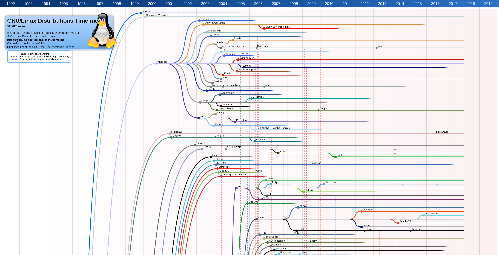
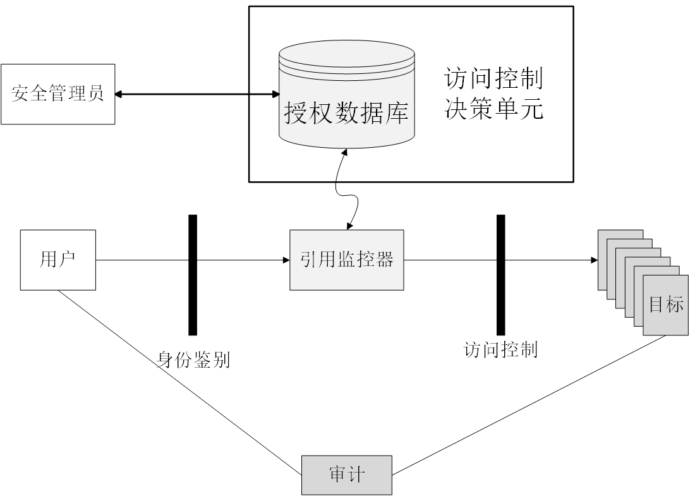
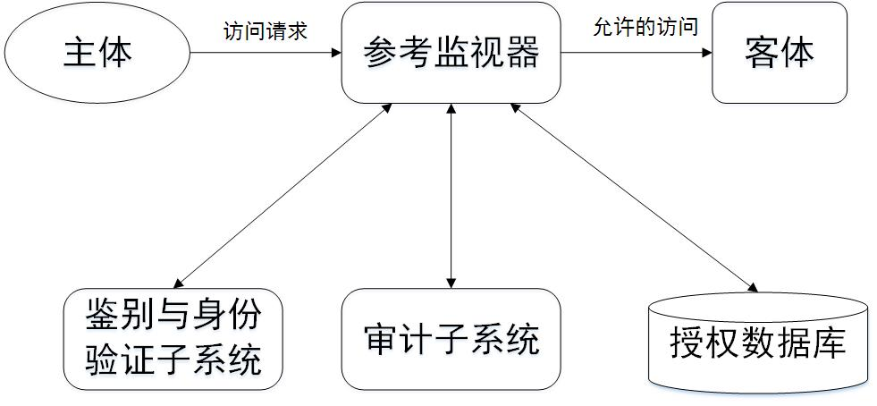
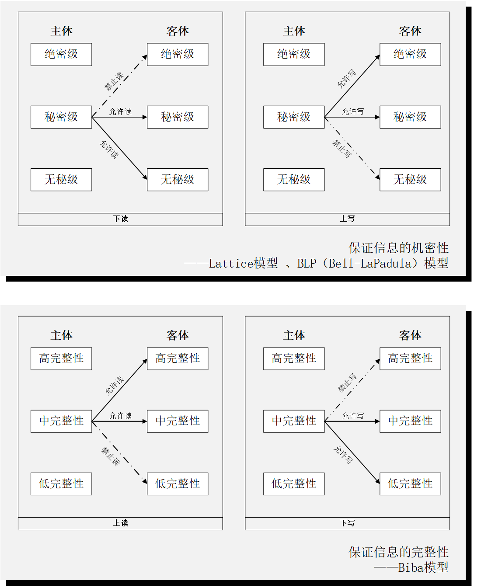
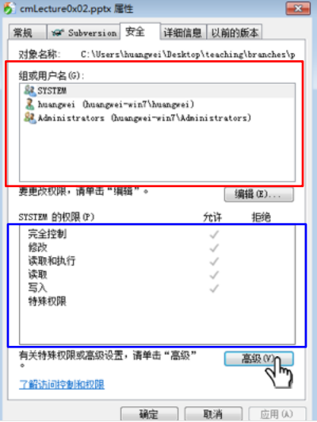
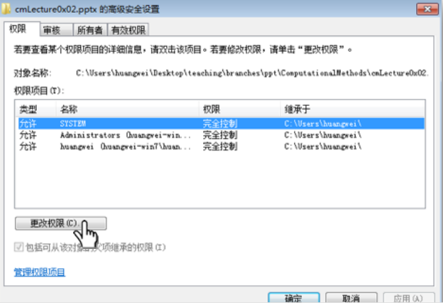
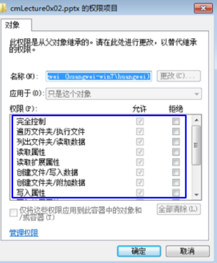
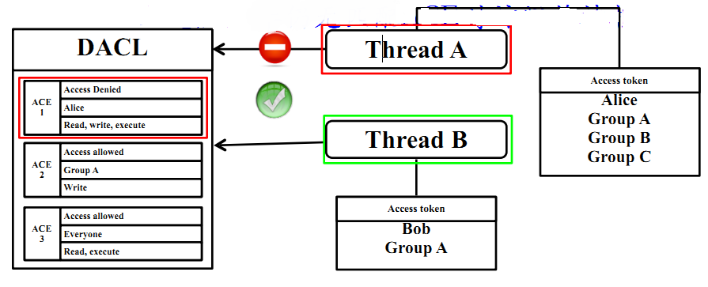

# 第二章 系统安全、风险评估理论与应用

重点内容：

* 访问控制理论
* CVSS 模型
* 风险评估案例

##  2.1 操作系统的简史

图 2-1 和 2-2 分别记载了现代操作系统的主要代表版本之间的渊源和发展关系，目前市场占用率最高的 2 大操作系统分支：Windows 和 Linux 的发展历史均超过了 20 年。回顾操作系统的发展史，我们会发现市场对操作系统的需求从最早的可用和易用，到繁荣发展阶段提出的新需求：安全和可靠。整个操作系统的进化史，就是现在和未来信息化发展进程的一个样板。研究操作系统安全原理和机制可以帮助我们设计更好、更安全的信息化系统、互联网和物联网应用。

特别的，我们可以再通过复盘桌面操作系统市场占有率最高的微软 Windows 操作系统的发展历史来学习一个典型生产力信息系统的发展过程。1981年，IBM 推出运行微软开发的 MS-DOS 操作系统的 IBM PC 主要解决的是推动个人电脑的市场需求发展问题，之后历时三年，微软又在 1985 年推出 Windows 1.0，希望通过提高个人电脑的易用性进一步促进个人电脑的普及率。后续微软又先后在 1987 年至 2005 年依次推出 Windows 2.0、Windows 3.0、Windows NT、Windows 95 等直到 Windows XP，Windows 操作系统的性能不断提升，界面也更为友好。与此同时，随着 Windows 市场份额的提升，各类针对 Windows 系统的计算机入侵和犯罪行为也在逐步酝酿发展直到全面爆发的各类蠕虫病毒事件接二连三出现。鉴于 Windows 在操作系统市场的份额巨大，大量利用 Windows 底层和内置应用程序漏洞的攻击代码的快速传播使得购买并部署了 Windows 系统的企业和个人消费者面临着巨大的安全威胁。为了避免苦心经营起来的操作系统市场垄断地位被这些安全威胁所击垮，微软在此后的 Windows Vista、Windows 7、Windows 8 重点提升安全和智能两个方面的能力，其中投入了更多的研发资源用于加固 Windows 底层安全，系统安全机制的改进和革新成为了微软在此之后每一代 Windows 产品研发过程中的一个持续改进特性。

## 2.2 数字标识理论

###  2.2.1 定义

- 实体（Entity）：指业务操作的发起者（主体）或对象（客体）。

- 标识（Identity）：标识又可称为“数字标识”，是对实体的数字化指代。

### 2.2.2 意义

对信息安全相关实体建立标识体系是构建信息安全系统的基础工作之一，例如身份验证、访问控制、安全审计、网络协议等都使用到了数字标识理论。

###  2.2.3 常用的数字标识技术

#### 2.2.3.1 系统实体标识

- (1) 系统资源标识

如操作系统中的文件标识（文件名和存储路径）和进程标识（进程号 PID ），或者数据库系统中的数据表标识（数据库名及表名）。

- (2) 用户、组和角色标识

如用户号（ID）、用户组号（GID）和特殊用户分组。

- (3) 与数字证书相关的标识

数字证书用于绑定证书所有者的情况及其公钥，在数字签名和认证中用于向签名验证者或身份认证者来提供这些信息。

- (4) X.509 证书

数字证书通常由证书签发者对证书签名，基于数字证书的标识具有抗篡改的特性。

#### 2.2.3.2 网络实体标识

- (1) 主机、网络和连接标识

  例如一台主机的标识从计算机网络通信的过程中来看，分别有几种不同的数字标识方法：
    * 数据链路层的 MAC 地址
    * 网络层的网络地址（对于 TCP/IP 网络，即 IP 地址）
    * 应用层的域名地址

- (2) 网络资源标识

统一资源定位符 URL（Uniform Resources Locator）

通过使用不同的 URL ，可以唯一的指代一个网络中的唯一资源。换句话来说，每一个网络中的实体都可以使用 URL 进行唯一的表示。

- (3) 连接及其状态标识

  如可以用 **IP五元组** 唯一标识一个网络（会话）连接

    - 源 IP 地址
    - 目的 IP 地址
    - 源端口
    - 目的端口
    - 传输层协议类型

## 2.3 访问控制理论

访问控制（Access Contorl）是计算机网络系统安全防范和保护的重要手段，是保证网络安全最重要的核心策略之一，也是计算机网络安全理论基础重要组成部分。

访问控制是在保障授权用户能获取所需资源的同时拒绝非授权用户的安全机制。网络的访问控制技术是通过对访问的申请、批准和撤销的全过程进行有效的控制，从而确保只有合法用户的合法访问才能会给予批准，而且相应的访问只能执行授权的操作。如下图所示为访问控制与其他安全服务的关系：

### 2.3.1 定义及组成

访问控制包含三要素：主体、客体、安全访问策略，相关术语定义如下。

* 主体

指主动的实体，是访问的发起者，它造成了信息的流动和系统状态的改变，主体通常包括人、进程和设备等。

* 客体

包含或接受信息的被动实体，客体在信息流动中的地位是被动的，客体通常包括文件、设备、信号量和网络节点等。

* 访问

使信息在主体和客体之间流动的一种交互方式。

* 授权访问

主体访问客体的允许，授权访问对每一对主体和客体来说是给定的

* 安全访问策略

一套规则，可用于确定一个主体是否对客体拥有访问能力。

主体对客体的操作行为集和约束条件集构成了一个安全访问策略。

###  2.3.2 访问控制的目的与内容

访问控制的首要目的就是为了保障系统的可控性，具体来说体现在了访问控制设计时需要考虑的三个基本面：

1. 认证

  * 包括主体对客体的识别认证和客体对主体检验认证。

  * 客体和主体的身份可以随着时间、应用场景而改变。

2. 访问授权

  * 控制策略的具体实现核心就是访问授权，授权主体对客体可以正常访问，非授权主体对客体无法访问。

3. 安全审计

  * 记录访问历史，实现不可抵赖性。

假设主体标识记为 ***A***，客体标识记为 ***a***。同时，为了描述问题的严谨性，访问行为记为 ***actionA***。则访问控制机制的核心内容可以表述为：主体 ***A*** 请求执行访问行为 ***actionA*** 于客体 ***a***，访问控制系统首先要求 ***A*** 提供认证凭据 ***c(a1,p1)***，证明 ***A*** 就是 ***A***（这个过程就是 ***认证***）。 如果证明失败，则拒绝访问，这一次访问控制流程结束。如果认证成功，则访问控制系统成功将数字标识 ***A*** 关联绑定到实体 ***A***，即证明了 ***A*** 确实是 ***A***。下一步授权检查则是查找 ***A*** 对 ***a*** 的请求访问行为 ***actionA*** 是否被允许，如果查无此授权，则访问控制系统拒绝访问，这一次访问控制流程结束。如果授权成功，则 ***A*** 终于可以对 ***a*** 执行访问行为 ***actionA***。

下图记录的就是上述认证和访问授权的内容和过程，除此之外，流程图中的（根据实际访问控制需要，甚至可以记录每一步流程的） ***主体（发起者）***、***客体（被访问对象）***、***发起时间***（可能包括起止时间）、***行为（内容）***、***行动步骤结果*** 都应该接受 ***安全审计***。

所以，一个完整的访问控制系统应该同时包含：认证、授权和审计模块，如下图所示就是一个典型访问控制系统的基本结构。

在安全审计环节，如何全面、准确、精细化标识一个主体往往是一个十分重要的关键技术点。例如，对于一个用户身份的确定，站在操作系统的角度可能会分为本地用户标识和网络用户标识 2 套体系。如果是网络用户，除了用户名之外，可能还可以辅助记录用户的：

* 访问来源 IP
* 远程访问所使用的客户端信息：客户端版本号、屏幕分辨率大小、客户端操作系统版本号等
* 用户输入用户名和口令的键盘输入速率

以上这些多维度用户标识信息的记录是目前主流的基于大数据风险控制模型所普遍采纳的用户精细化画像技术基础，虽然采集的信息更丰富了，但这些信息都是用于构建主体身份的数字标识。访问控制理论和模型会随着信息技术的发展而不断改进和革新的同时其基本模型并没有过时和被颠覆。

###  2.3.3 访问控制策略

访问控制模型根据访问控制策略的差异可分为自主访问控制、强制访问控制和基于角色的访问控制三大类。

1. 自主访问控制

自主访问控制（Discretionary Access Control, DAC） 的特点是根据主体的身份及允许访问的权限进行决策。所谓自主是指具有某种访问能力的主体能够自主地将访问权的某个子集授予其他主体。

  典型实现方法有：

* 访问控制列表（Access Control List, ACL）
* 访问控制矩阵
* 面向过程的访问控制

  一个典型的访问控制矩阵设计如下：

  <table>
   <tr>
      <td></td>
      <td>文件A</td>
      <td>文件B</td>
      <td>进程A</td>
      <td>进程B</td>
   </tr>
   <tr>
      <td>进程A</td>
      <td>读、写、属主</td>
      <td>读</td>
      <td>读、写、执行、属主</td>
      <td>写</td>
   </tr>
   <tr>
      <td>进程B</td>
      <td>追加</td>
      <td>写、属主</td>
      <td>读</td>
      <td>读、写、执行、属主</td>
   </tr>
  </table>

  上述访问控制矩阵应用的目标系统中有 2 个进程和 2 个⽂件，该系统支持的访问权限集合定义为：{读、写、执⾏、追加、属主}。上述访问控制矩阵可以按照如下示例进行解读：

  * 进程 A 对文件 A 拥有读、写和属主权限，对文件 B 只有读权限，对自己拥有除追加之外的所有权限，对于进程 B 只有写权限。
  * 进程 B 对文件只有追加权限，对文件 B 有写和属主权限，对进程 A 只有读权限，对自己拥有除追加之外的所有权限。
  * 拥有属主权限的进程（主体）可以对目标客体的权限自主分配。这就意味着，虽然按照当前的访问控制矩阵定义：进程 B 对文件 B 没有读、执行和追加权限，但由于进程 B 拥有文件 B 的属主权限，所以进程 B 可以随时给自己添加这几项权限授权。类似的，拥有属主权限的主体也可以取消自己已获得的授权，只要主体还拥有属主授权，则随时可以调整其他权限授权的授予或撤销。

  自主访问控制的优点是灵活性高，缺点是信息在移动过程中其访问权限关系会被改变。如用户 A 可将其对目标 a 的访问权限传递给用户 B，从而使不具备对 a 访问权限的 B 可访问 a。这种行为的出现通常会导致整体安全策略被局部的这种自由访问行为突破，降低系统的集中可控性。

2. 强制访问控制

  强制访问控制（Mandatory Access Control, MAC）的特点是它取决于能用算法表达的并能在计算机上执行的策略，通常强制访问控制的实现都是内置在操作系统源代码里的算法实现，在系统发布部署后无法被修改。

  最常见的强制访问控制是 ***基于规则的访问控制（Rule Based Access Control, RBAC）*** 。强制访问控制是基于用户和资源分级（“安全标签”）的，一般是多级访问控制。所谓安全标签是分配在目标上的一组安全属性信息项。在访问控制中，一个安全标签隶属于一个用户（主体）、一个目标（客体）、一个访问请求或传输中的一个访问控制信息。

  按照保密性等级定义的安全级别一般有四级：绝密级（Top Secret），机密级（Confidential），秘密级（Secret），无秘密级（Unclassified）。保密等级由高到低依次是：T ＞ C > S ＞ U。

  基于以上安全级别定义，用户与访问的信息的读写关系将有四种，即：

(1) 下读（read down）。用户（安全）级别大于文件（安全）级别的读操作。

(2) 上写（write up）。用户（安全）级别低于文件（安全）级别的写操作。

(3) 下写（write down）。用户（安全）级别大于文件（安全）级别的写操作。

(4) 上读（read up）。用户（安全）级别低于文件（安全）级别的读操作。

  上述读写方式都保证了信息流的单向性，上读—下写方式保证了数据的完整性（完整性保护强制访问控制模型），上写—下读方式则保证了信息的机密性（机密性保护强制访问控制模型）。基于这 2 种信息流动模型定义的经典访问控制模型如下图：

下面我们用智能手机上常见的系统相机应用为例说明什么是机密性保护访问控制模型：

手机锁屏状态下，无需解锁使用专用相机开启快捷方式就可以拍照，且可以查看本次启动相机后所有拍摄的相片，但不可以查看手机相册中其他任意文件。不仅如此，再次锁屏后重新启动相机也不能查看上一次启动相机期间拍摄的照片。

> 解读如下：

  * 手机锁屏状态下的所有操作，操作系统均视为是 ***客人用户***（低安全等级）行为，系统相册相对于 ***客人用户*** 的安全等级要高。***客人用户*** 使用相机应用程序可以拍照，照片存储在系统相册中相当于是一次 ***上写*** 行为，这是被允许的。
  * ***客人用户*** 自己拍摄的照片自己可以看是合理的，因为这是 TA 亲自录入的“秘密”，所以可以查看，相当于是一次 ***下读*** 行为。
  * 由于启动相机程序无法进行身份认证，所以如果 ***客人用户*** 锁屏后重新启动相机程序，系统无法分辨前后 2 次相机启动的主体是不是同一个人，但至少都不是系统的”主人”。因此，禁止 ***客人用户*** 查看系统相册数据是合理的，相当于是禁止 ***上读*** 行为。

类似的，我们还能找到现代操作系统中符合“上读-下写”的完整性保护系统强制访问控制模型。例如，用户信息数据库中的用户名字段是允许系统中所有需要调用身份认证 API 的进程读取的，但用户信息数据库的更新必须通过特权进程作为代理才能完成用户信息数据库的写入操作。这就是一个完整性保护的强制访问控制模型在实际中应用的实例。

3. 基于角色的访问控制

  基于角色的访问控制（Role-Based Access Control, RAC）起源于 UNIX 系统中组的概念，是与现代的商业环境相结合的产物。基于角色的访问控制是一个复合的规则。一个身份被分配给一个被授权的组。每个角色与一组用户和有关的动作相互关联，角色中所属的用户可以有权执行这些操作。角色与组的区别是：组只是一组用户的集合，而角色则是一组用户的集合加上一组操作权限的集合。基于角色的访问控制特点有：

  (1) 该策略陈述易于被非技术的组织策略者理解，同时也易于映射到访问控制矩阵或基于组的策略陈述。
  (2) 同时具有基于身份策略的特征与基于规则策略的特征。
  (3) 在基于组或角色的访问控制中，一个用户可能是不止一个组或角色的成员，有时又可能有所限制。
  (4) 用户不能任意的将访问权限传递给其他用户，这是和 DAC 的最基本区别。

  优点是：责任分离、角色分层、角色激活和用户角色关系的约束。

  基于角色的访问控制模型可以用下图总结：

###  2.3.4 访问控制机制

访问控制机制就是对访问控制策略的具体实现方式和过程。按照访问控制策略的 3 个基本面定义，实现访问控制就需要分别实现：认证、授权和审计。

1)  （身份）认证

认证的实现过程就是将主体（数字）身份标识唯一的绑定到（真实）主体的过程。

在访问控制策略的目的与内容一节我们提到了主体需要向访问控制系统的身份认证模块证明：***我就是我*** 。在实践中总结出来的可以用于证明 ***我就是我*** 的因素主要有4类：

* （只有我）知道的。例如，口令或秘密信息。属于 only I *** know *** 。
* （只有我）拥有的。例如，数字证书、令牌或磁卡。属于 only I *** have *** 。
* （只有我）生物特征。例如，指纹、虹膜。属于 only I *** am *** 。
* （只有我）实体位置。例如，在特定地区终端上。属于 *** where *** only I am。

以上几类因素可以单一使用，也可以多个组合使用。在实践中需要注意防范的身份认证类威胁主要有：

* 暴力破解。通常通过字典攻击的方式来实现，如果字典具有很强的针对性（例如使用公开泄漏的第三方网站账号密码数据库作为字典），则冒用身份的成功率就会很高。
* 重放攻击。例如截获明文传送的用户名口令或者授权 cookie 直接重放通过系统认证，达到冒用身份的目的。活体指纹提取和重建技术被用来骗过指纹验证系统。使用代理服务器 IP 地址或直接使用目标主机局域网中其他主机来绕过访问控制系统基于来源 IP 的身份检查。
* 物理攻击。例如直接盗取令牌或意外遗失令牌带来的身份冒用问题，突破物理安防直接进入专用操作室等。
* 找回身份攻击。虽然不同身份认证因素的安全性在不同业务场景下各有优缺点，但在实际构建身份认证系统中还有另一类常见需求，即：如果丢失或忘记其中一项认证因素后，合法用户如何找回或重置该类认证因素从而通过身份认证环节呢？例如，虽然用户设置了强口令。但系统同时提供的忘记口令找回功能使用的是 4 位数字的短信验证码，则相当于给攻击者提供了一个更容易得手的攻击入口。

因此，在实际构建访问控制系统的身份认证模块时，为了提高身份认证的可靠性，对抗上述主要威胁，采用双因素或多因素认证是一个可行的最佳实践路线方向。除此之外，不同认证因素的安全性等级也需要经过一个严谨的风险评估过程，确保在提供找回身份或认证凭据功能时，最高等级的身份认证因素可以用于安全的重置或更换其他认证因素。

2) （访问）授权

授权系统需要实现的授权类型主要有 3 大类：

- 授予(grant)权限，拥有该权限的主体可以将所拥有的客体访问权限分配给其他主体；

- 撤销(revoke)权限，拥有该权限的主体可以将其他主体已获得的授权予以撤销。之所以需要撤销访问授权，一般主要发生在以下 2 类应用场景：

* 认证凭据丢失/被盗
* 人员变动（离职/岗位变动等）

关于如何撤销，一般从下面两个环节入手：

* 身份认证环节，禁用/取消/删除认证凭证；
* 访问授权环节，禁用/取消/删除/修改访问控制列表中的授权项。

- 属主(own)权限，客体的创建者通常都会拥有属主权限，该权限可以由创建者自由授予他人或撤销对他人的授权。在实现属主权限机制时，需要注意遵循权限的弱化原则：

* 主体无法将自己不具备的权限授予他人；
* 主体如果具有属主权限则不受上述原则约束。

综上，身份认证是访问授权的基础，没有身份认证就无法实现访问授权。

3) （访问）审计

访问审计是为了检测是否存在违反安全（访问控制）策略的行为和重建安全事件；其内涵表现为主体对客体的访问行为会被记录，用于安全责任追查和认定。典型的访问审计实现手段是日志。

###  2.3.5 从授权的角度看 Windows7 访问控制模型

在 windows7 中主要使用了访问令牌（主体的数字标识）和安全描述符（客体的数字标识）。访问令牌是与特定的 windows 账户关联的，会与特定进程绑定（进程中的线程默认会继承该访问令牌），当线程访问某个对象时，Windows 就会使用这个线程特有的令牌进入访问控制授权检查。安全描述符是与被访问对象关联的，安全描述符的主要构成有：对象所有者(Owner)，通过一个安全标识符 SID 进行唯一标识；对象主要组（Group），通过SID唯一标识，仅用于兼容 POSIX 程序，Windows 程序通常忽略此参数；自由访问控制列表（Dacl），自主访问控制列表中包含的 0 或多个 ACE （访问控制项）；系统访问控制列表（Sacl），定义系统审计规则。

从上面一系列图中可已看出在 windows7 中权限的划分已是非常的详细。而在 windows7中访问控制的权限检查如下图：

线程访问对象是系统会顺序遍历检查 DACL 中的 ACE ，匹配成功，ACE 即终止遍历并执行 ACE 标识策略，而当 DACL 遍历完毕仍无匹配 ACE 时访问将被拒绝。

## 2.4 通用安全漏洞评估系统（CVSS）

CVSS 英文全称 Common Vulnerability Scoring System ，即通用安全漏洞评估系统，是由 NIAC 开发、FIRST 维护的一个开放并且能够被各产品厂商免费采用的行业标准。CVSS 不使用“危急”、“重要”等严重等级用语，而是为所有安全漏洞的严重程度提供了一个量化评估值。CVSS 从三个不同的方面进行安全评估：基本评估、时效性评估和环境评估，最终得到一个介于 1 到 10 之间的数字（ 10 分表示能够完全攻破操作系统层的安全漏洞），这个数字表示了安全漏洞的总体严重性，分值越大，风险越大。不管安全漏洞是什么类型的漏洞，无论它是操作系统的，还是数据库或者商务应用程序的，也不管是哪个厂商产品的安全漏洞，从 CVSS 的分值上，任何人都可直观判断出安全漏洞的严重程度。

CVSS 的使用者包括安全漏洞公告者、各类软件提供商、安全漏洞扫描和管理服务商、安全性（风险）管理和研究人员。综上所述通用漏洞评分系统（CVSS）是一个开放的框架，它提供的好处可总结为三点：

1.  标准的漏洞成绩：当一个组织在其所有的软件和硬件平台规范化漏洞分数时，它可以利用一个漏洞管理政策。这一政策可能类似于一个服务级别协议（SLA），指出风险较大的漏洞必须尽快进行验证和修复。

2.  开放架构：当漏洞得到一个分值时，用户可能会困惑。“哪个属性给它评的分？它怎么就和昨日公布的有所不同？”而通过 CVSS，任何人都可以看到用于导出分数的个体特征。

3.  风险优先级：当环境评估完成时，漏洞的优先级已被划分。也就是说，漏洞的分数代表实际风险大小的程度。故而用户便知道了漏洞之间的轻重缓急

###  2.4.1 CVSS 的评估系统

CVSS 评估系统由评估指标和评估过程两大部分构成，评估指标分为三组，分别是基本评估指标、时效性评估指标和环境评估指标。

1.  基本评估指标

  基本评估指标描述安全漏洞固有的、根本性的属性，这些属性不随时间或用户具体环境的变化而改变，CVSS 基本评估指标包括 6 个指标：入侵途径、入侵复杂性、身份认证要素、信息机密性影响、信息完整性影响、服务持续性影响。

2.  时效性评估指标

  时效性评估指标是指安全漏洞与时间相关的属性，这些属性可能随着时间的变化而变化，CVSS 有三个时间评估指标。时效性评估指标是可选择性指标，所以每个指标的取值均包含 Not Defined 可选项，当选用 Not Defined 可选项时，该指标将不影响安全漏洞的最终评分。时效性评估指标包括以下内容：安全漏洞的可用性、修补措施的有效程度、安全漏洞报告的可信度。

3.  环境评估指标

  环境评估指标在不同的用户的具体使用环境中，产品安全漏洞所造成危害程度也不同，CVSS 有三个环境度量指标。

  > 环境评估也是可选择指标，每个指标的取值也包含 Not Defined 可选项，当选用 Not Defined 可选项时，该指标将不影响安全漏洞的最终评分。

  > 所有可能的潜在损失：该指标即衡量安全漏洞可能带来的实物资产损失，信息被盗取的损失，也衡量工作效率和业务收入方面收到的经济损失。

  > 实施规模：此指标用来衡量产品使用规模对安全漏洞危害的影响。

安全性需求：此指标包含三个子指标，用来衡量对用户而言，受安全漏洞影响的 IT 系统在机密性、完整性、服务可用性方面的相对重要程度。

###  2.4.2 基本评估原则

基本评估原则有四条：

1.  每个安全漏洞都必须单独评估，不得考虑与其他安全漏洞的交叉影响；

2.  只考虑每个安全漏洞的直接影响，不考虑其他间接影响；

3.  应该按照通常使用的权限来评估安全漏洞的影响，例如：假设客户端应用使用的是根用户权限，而 Web 应用则假设使用的是普通用户权限；

4.  当安全漏洞有很多种入侵途径时，应该能造成最大伤害的入侵途径为依据。

###  2.4.3 评估公式和评估过程

先用公式计算基本评估指标，得到安全漏洞的一个基本分数，然后在此基础上添加时效性评估指标影响因子，最后再添加环境评估指标影响因子，最后得到一个最终的评估分数。关于详细的评估公式和算法可以参考 [http://www.first.org/cvss](http://www.first.org/cvss) 。

通常情况下，软件和安全产品提供商需要提供安全漏洞的基本分数和实效性评估指标影响因子，最终用户则需要对环境评估指标影响因子进行评估和计算。

### 2.4.5 CVSS 3.0 和 CVSS 2.0

截止本书撰写时的最新 CVSS 版本是 CVSSv3.0，正式发布于 2015 年 6 月，本书上述介绍的 CVSS 规范内容主要是基于 CVSSv2.0，新版本相比较于过去，主要的改动总结如下：

* 在基本评估指标中
    * 用户交互（UI, User Interaction）和必要权限（PR, Privileges Required）是 2 个新加入的指标。
        * 其中，必要权限指标用来替换了过去的认证（Authentication）指标，用户交互指标原先是暗含在访问方式（AV, Access Vector）指标中的。
    * 同时，加入了一个新的叫做(权限)范围（Scope）的指标，用于描述一个被漏洞利用攻击是否改变了原有的访问控制模型权限集合定义。一个具体的例子可以看这里 [What’s new in CVSS version 3](http://www.acunetix.com/blog/articles/whats-new-in-cvss-version-3/) 。
    * 访问复杂度（Access Complexity）指标被重命名为攻击复杂度（Attack Complexity）指标，和访问控制相关的评价因素被移动到了一个独立的指标（Privileges Required）中。一个被评定为“高”级别的攻击复杂度指的是攻击的复现率低，即可能需要精确的计时、特殊的网络传输环境才能成功触发漏洞。换句话来说，即使同一个目标、同一份漏洞利用代码也不能保证 100% 的攻击成功，有较高的概率可能会随机失败。
        * 同时，在攻击复杂度指标中，新增加了一个取值：物理（Physical），这主要是针对在现实中有一些攻击行为是需要物理接触到被攻击目标系统的。例如，漏洞利用代码是针对 USB 设备驱动的，在实际攻击时需要在目标主机上插入一个定制化的 U 盘才能成功触发该漏洞。
* CIA（机密性、完整性和可用性）三项指标的取值范围集合从{None, Partial, Complete}变更为{None, Low, or High}
* 环境评估指标整个被重写了。相当于是基本评估指标每一个二级指标的演化版。演化的依据则是来自于不同的组织、网络和系统在实际部署 IT 系统时通常会根据自身业务需要进行量身定制甚至是二次开发和改造。
* 漏洞评估分数对应的危害级别被重新微调。新增：无危害（None）级别对应 0 分。原高危级别评分范围从 7.0-10.0 修改为 7.0-8.9 。新增危急级别，对应评分取值范围：9.0-10.0。

CVSS 3.0 对应的指标和取值范围表格按照官网文档摘录总结如下：

<table>
   <tr>
      <td>Metric Group</td>
      <td>Metric Name</td>
      <td>Possible Values</td>
      <td>Mandatory</td>
   </tr>
   <tr>
      <td rowspan = "8">Base</td>
      <td>Attack Vector, AV</td>
      <td>[N,A,L,P]</td>
      <td>Yes</td>
   </tr>
   <tr>
      <td>Attack Complexity, AC</td>
      <td>[L,H]</td>
      <td>Yes</td>
   </tr>
   <tr>
      <td>Privileges Required, PR</td>
      <td>[N,L,H]</td>
      <td>Yes</td>
   </tr>
   <tr>
      <td>User Interaction, UI</td>
      <td>[N,R]</td>
      <td>Yes</td>
   </tr>
   <tr>
      <td>Scope, S</td>
      <td>[U,C]</td>
      <td>Yes</td>
   </tr>
   <tr>
      <td>Confidentiality, C</td>
      <td>[H,L,N]</td>
      <td>Yes</td>
   </tr>
   <tr>
      <td>Integrity, I</td>
      <td>[H,L,N]</td>
      <td>Yes</td>
   </tr>
   <tr>
      <td>Availability, A</td>
      <td>[H,L,N]</td>
      <td>Yes</td>
   </tr>
   <tr>
      <td rowspan = "3">Temporal</td>
      <td>Exploit Code Maturity, E</td>
      <td>[X,H,F,P,U]</td>
      <td>No</td>
   </tr>
   <tr>
      <td>Remediation Level, RL</td>
      <td>[X,U,W,T,O]</td>
      <td>No</td>
   </tr>
   <tr>
      <td>Report Confidence, RC</td>
      <td>[X,C,R,U]</td>
      <td>No</td>
   </tr>
   <tr>
      <td rowspan = "11">Environmental</td>
      <td>Confidentiality Req., CR</td>
      <td>[X,H,M,L]</td>
      <td>No</td>
   </tr>
   <tr>
      <td>Integrity Req., IR</td>
      <td>[X,H,M,L]</td>
      <td>No</td>
   </tr>
   <tr>
      <td>Availability Req., AR</td>
      <td>[X,H,M,L]</td>
      <td>No</td>
   </tr>
   <tr>
      <td>Modified Attack Vector, MAV</td>
      <td>[X,N,A,L,P]</td>
      <td>No</td>
   </tr>
   <tr>
      <td>Modified Attack Complexity, MAC</td>
      <td>[X,L,H]</td>
      <td>No</td>
   </tr>
   <tr>
      <td>Modified Privileges Required, MPR</td>
      <td>[X,N,L,H]</td>
      <td>No</td>
   </tr>
   <tr>
      <td>Modified User Interaction, MUI</td>
      <td>[X,N,R]</td>
      <td>No</td>
   </tr>
   <tr>
      <td>Modified Scope, MS</td>
      <td>[X,U,C]</td>
      <td>No</td>
   </tr>
   <tr>
      <td>Modified Confidentiality, MC</td>
      <td>[X,N,L,H]</td>
      <td>No</td>
   </tr>
   <tr>
      <td>Modified Integrity, MI</td>
      <td>[X,N,L,H]</td>
      <td>No</td>
   </tr>
   <tr>
      <td>Modified Availability, MA</td>
      <td>[X,N,L,H]</td>
      <td>No</td>
   </tr>
</table>

### 2.4.6 CVSS 的局限性和不足

以下点评内容主要针对 CVSS 最新的 3.0 版本，所有观点同样适用于之前版本。

* CVSS 的基本评分原则是：基于客观事实的主观评价打分。对于基本评估指标，通常是业界专家针对已掌握的漏洞细节信息进行中立评分，基本可以通过分数反映出漏洞的严重性程度。但是对于时效性指标，由于攻防信息的天然不对称性，守方可能由于信息不对称性带来的局限性，无法准确评估漏洞危害（通常倾向于低估漏洞危害）。同时，对于环境评估指标，更是需要每一个企业、网络和系统管理员团队依据自身掌握的系统状态进行评估。但在实践中，由于甲方单位安全工程师团队水平的参差不齐就会导致环境评估指标评分偏离实际危害性程度。但在 CVSS 的评分体系里和我们实际看到的所有漏洞通告和漏洞信息数据库中，往往只是用到了基本评估指标计算出的漏洞危害评分，对于时效性和环境指标则由于上述一些客观原因没有进行评估。脱离时效性和环境指标只根据软件版本号去评估实际网络和系统中的漏洞很容易得到一些片面的评估结论。
* CVSS 是针对单一漏洞危害的评价指标，而实际的网络与系统攻击过程往往是多个漏洞的组合利用过程，多个低危漏洞的优化组合同样可能会对企业网络和系统带来致命一击。风险评估过程不能简单唯 CVSS 评分值高低去对发现的漏洞安排应急响应的优先级，要统筹全局所有漏洞进行整体评估。
* 高危漏洞的修复方式难度和低危漏洞修复方式难度并没有直接的可比性，这是 CVSS 评估标准没有去考虑的一个重要因素。在实践中，很多高危漏洞的实际修复方式可能非常简单很快就能全网覆盖部署。反而是一些低危漏洞的修复过程充满了曲折，甚至会导致一些额外的修复代价。这是在实际应急响应时不能简单唯 CVSS 评分值高低去进行应急响应规划的一个重要原因。
* 除此之外，也有业界同行对于 CVSS 在物联网领域的应用提出了一些具体质疑，具体可以看这篇文章： [CVSS and the Internet of Things](https://insights.sei.cmu.edu/cert/2015/09/cvss-and-the-internet-of-things.html)

###  2.4.7 CVSS 的应用

无论标准指定的多么科学和完善，要想在现实应用中发挥功效，必须要和具体的应用环境相结合，实现标准的落地。以往的研究和实例表明，高水平的企业一般拥有一个可重复执行、持续改进的系统来管理和治理安全漏洞，与同样规模的企业相比，他们发生的安全事件更少。当事件发生时，也许他们的规划统筹工作占用了一些时间，开始处理问题的速度不是最快的，但是总体执行效率和质量确实比较高的。比较具体的建议包括：

1.  漏洞管理得到单位管理层的重视和支持，漏洞管理工作流程化、制度化、日常化，并有专门的部门和人员负责实施与检查。

2.  单位要建立高效、准确、更新及时的计算机资产管理系统，保持所有计算机资产的完整清单，关键配置、用途与使用人、资产重要性等信息都要记录，这些基础信息的正确与否对于 CVSS 的正确应用至关重要。作为最终用户来说，当使用 CVSS 评估安全漏洞的严重程度时，需要对环境评估指标影响因子进行评估和计算，这个计算是产品供应商和安全管理机构无法替代的，只有自己来完成。

3.  探索和使用自动化管理工具，提高漏洞管理的工作效率。

4.  对计算机设备推进标准化配置，尽可能减少整个组织内安全漏洞的种类，相应简化了所需的处理措施，工作人员不能随意的重新配置计算机系统和安装软件，任何与标准不否的配置都要在资产管理系统中进行详细的记录和说明，要做到管理者熟知每一台计算机设备的配置，要了解初始化配置是如何做的，以及以后又有谁实施过那些变动。

## 2.8 风险评估的实践案例

[360终于承认其儿童手环存在两个安全漏洞，但又强调是低危漏洞，请问安全大牛，那两个漏洞危害等级究竟如何？【来自知乎】](http://www.zhihu.com/question/26373469) ，我在这个问题下有回答，同时，可以看到其他一些从业人员对这个相同漏洞的风险评估结果和思考过程。

留个小作业给大家，欢迎大家去回答 [知乎上的这个问题：如何看待最近爆出的 IE 全版本执行漏洞（CVE-2014-6332）？](http://www.zhihu.com/question/26653127)

## 2.9 操作系统的访问控制设计实例研究

* 以 iOS 和 Android 系统为研究对象
    * 当系统处于锁屏状态下接收到新短信时，不解锁情况下
        * 系统是否允许查看短信内容？
        * 系统是否允许回复短信？
        * 安卓上的 App : 以 ***微信电话本*** 为例，在接管了系统短信功能和权限之后，是否会有一些不同的功能设定？
    * 当系统处于锁屏状态下，使用系统内置（例如 iOS 的 Siri ）或第三方的语音助手可以完成以下哪些操作？
        * 访问通讯录
        * 拨打电话
        * 访问相册
        * 查看短信收件箱
    * 如果你的手机支持指纹识别解锁手机，请实验并分析指纹识别相比较于简单密码、复杂密码、图形解锁、人脸识别解锁、声纹解锁等解锁方式的安全性、便利性差异。

思考题：

* 以上设计实现方式属于我们课堂上讲过的哪种强制访问控制模型？Lattice/BLP？Biba？
* 系统或第三方应用程序是否提供了上述功能的访问控制规则修改？如果修改默认配置，是提高了安全性还是降低了安全性？

实验注意事项：

* 请准确记录、描述你的实验运行环境信息，包括但不限于：操作系统版本（如果是第三方应用，请给出精确版本号）、硬件设备型号、是否默认设置。
* 请综合运用访问控制模型、威胁建模、安全假设和信任等专业知识和语言论证以上安全问题。

## 2.10 课后题

1.  生物特征身份认证方式有哪些？优缺点分析？应用场景举例。

2.  “找回口令功能”和“忘记密码”在访问授权机制中的意义？请尝试设计几种安全的“找回口令功能”，详细描述找回口令的用户具体操作过程。

3.  绘制用户使用用户名/口令+图片验证码方式录系统的流程图。考虑认证成功和失败两种场景，考虑授权成功和失败两种场景。

4.  Windows XP / 7 中的访问控制策略有哪些？访问控制机制有哪些？

5.  用权限三角形模型来理解并描述下 2 种威胁模型：提权、仿冒。

6.  试通过操作系统的访问控制机制来达到预防一种真实病毒的运行目的。

7.  什么是 OAuth？

8.  什么是 OpenID？

9.  试用本章所学理论分析 0Auth 和 OpenID 的区别与联系。

10. 如何使用 OAuth 和 OpenID 相关技术实现单点登录（Single Sign On）？

## 2.11 本章参考文献

1. [一个很棒的第三方CVE/CVSS/CWE漏洞信息汇聚站点](https://www.cvedetails.com/)
2.  安全漏洞如何评级，张玉清.
3.  朱理森，张守连，计算机网络应用技术[M].北京:专利文献出版社， 2001.
4.  网络安全威胁的主要来源[EB/OL].
5.  李吴，山秀明，任勇.网络安全概述[JI]中国工程科学，2004（1）：10\~12.
6.  李锐.通用安全漏洞评估系统-CVSS-简介及应用建议.
7. [Common Vulnerability Scoring System Specification Document](https://www.first.org/cvss/specification-document)
8. [Curated list of public penetration test reports released by several consulting firms and academic security groups](https://github.com/juliocesarfort/public-pentesting-reports)
9. [中国信息安全测评中心 - 申请书下载](http://www.itsec.gov.cn/export/sites/itsec/systems/download/)
