# 第三章 网络安全应用基础

重点内容：

* 常见代理服务
* 高级代理服务
* 代理服务的检测

## 3.1 常见的代理服务

### 3.1.1 基本概念

如上图所示就是一个典型的代理服务模型，客户端和服务器之间的实体就是一个代理服务器。代理服务器在客户端和服务器的通信过程中扮演了一个“中间联系人”的角色。站在客户端角度看：代理服务器似乎就是真正的服务提供者。站在服务器的视角看，代理服务器就是那个真正发起请求的客户端。所以，典型的代理服务器都会包含“客户端”和“服务器”两个基本功能模块。部分代理服务器为了改进客户端的用户体验，会把一些经常被访问到的且服务器不会经常变更的内容“缓存”一份在代理服务器上，一方面可以减少请求服务器的次数，降低服务器压力。同时也避免了代理服务器和服务器之间重复的数据传输。

网络代理按照工作模式的差异可以分为以下几种类型：

1. 转发代理。它是一种正向代理，也是一种最常见的代理类型，我们常说的代理服务器即转发代理；其典型应用就是为处于防火墙后的内部客户端提供访问外部互联网。例如校园网用户通过代理访问外国网站。
2. 开放代理。是互联网上人人可访问的转发代理。
3. 反向代理。将客户端请求转发给后端服务器集群中的某个节点处理并返回处理结果给客户端。是互联网用户访问大型网站集群的常见方式，同时也可以保护一些重要服务器免受外部的直接攻击。同时，反向代理服务器通常会内置缓存功能模块，用于将集群中经常被用户访问的不变内容持久化存储，降低诸如数据库之类的服务应用的访问压力。如果反向代理服务器同时可以监控集群中服务器的服务质量和运行时性能，将客户端请求转发到最低负载或最佳状态服务器，则说明这个代理服务器同时扮演了“负载均衡器”的角色。

转发代理的典型应用场景：

1. 过滤。由于客户端和服务器的所有通信数据都会经过代理服务器，因此可以通过监视和扫描通信数据对不符合访问控制策略和内容安全策略的通信数据进行在线过滤。既可以实现限制客户端访问非法网站，也可以防止用户下载来自恶意网站的恶意代码。
2. 缓存。例如，用户 A 已经下载过的一款应用软件，用户 B 再下载该软件时，代理服务器可以通过比对下载 URL 的一致性、缓存的过期策略设置、客户端 HTTP 请求头里的缓存控制设置直接返回缓存的该软件给用户 B，使得用户 B 可以享受到就近下载的飞速体验。
3. 绕过内容过滤和网络审查。例如公司内员工使用网络管理员设置的黑名单之外的 IP 地址搭建转发代理服务器就可能会绕过公司对某些网站的访问限制，从公司网络安全管理的角度来说这就是一个典型的内部风险点。
4. 日志和嗅探。这是代理服务器的基本工作原理就决定了的典型功能，所有代理服务器的使用者都应该意识到代理服务器会对通信内容进行日志记录和嗅探。
5. 私有网络的网关。常见于一些安全保护等级较高的内部网络，通过设置专有应用的代理服务，限制内部用户使用有限的通信协议来和网络外部进行数据交换。
6. 匿名服务访问。详见下一节关于匿名通信服务原理和应用场景的阐述。

反向代理的应用场景：

1. 提升加密链接性能。
2. 负载均衡。
3. 静态内容缓存。
4. 压缩（代理）。例如 HTTP 代理服务器可以主动将后端的 HTTP 服务器的响应内容使用 gzip 进行压缩后再传输给浏览器，节约传输带宽，提高下载速度。支持 gzip 的浏览器可以在接收到内容之后在客户端进行实时的解压缩，然后渲染呈现页面。
5. 适配低网速客户端。主要见于一些基于 TCP 协议的网络应用，对于服务器操作系统来说，高并发连接数的维持对于系统内存、网络连接句柄等有限资源来说都是一种可度量的负担和成本。低网速客户端往往意味着完成一次请求响应会话会比其他客户端占用更多的服务器处理时间，内存和网络连接句柄将会长时间被占用而不能及时释放给其他客户端使用。通过代理服务器的预加载、低速客户端排队、推送等技术的组合运用，低速客户端在不用长时间占用服务器资源的同时获得高质量的服务。
6. 安全网关。
7. 外网发布。特别对于一些官方新闻站点、展示型站点，不需要用户反馈和交互功能，代理服务器可以提供全静态的只读网页服务。所有动态内容可以通过内部专网的访问入口进行添加而后发布成静态文件同步推送到代理服务器上。

任何事物都存在两面性，网络代理亦然。代理服务亦正亦邪，它既可以用于保护内部网络服务器和客户端用户，同时也可能成为内部网络边界上的一个监管黑洞，成为恶意代码和恶意内容传输的一个私有通道。所谓的“正”，是指通过网络代理可以加密通信数据，防止通信数据被窃听和篡改。通过审查网络通信数据，进行恶意流量检测和过滤并可发现、阻止失泄密行为。改变网络拓扑结构，实现跨局域网/异构网络通信。以上均保证了通信过程的机密性和完整性。另一方面，所谓的“邪”，体现在可隐藏访客来源 IP ；绕过网络安全审查/检测机制。威胁网络安全检测、审计机制。代理服务的“正”与“邪”，很好的展示了网络安全的对抗本质。

###  3.1.2 HTTP 代理

####  3.1.2.1 HTTP 的简单介绍

HTTP 协议即超文本传输协议，是互联网上进行信息传输使用最为广泛的一种通信协议。HTTP 的基本连接过程可分为三步：

1. 建立连接（连接准备、连接）。
2. 客户端发送请求、服务器发送响应。
3. 关闭连接。

以下是 HTTP 及其相关协议的的协议家族不完全列表。

- RFC 2616: Hypertext Transfer Protocol -- HTTP/1.1
- RFC 2617: HTTP Authentication: Basic and Digest Access Authentication
- RFC 2818: HTTP Over TLS
- RFC 6265: HTTP State Management Mechanism
- RFC 2145: Use and Interpretation of HTTP Version Numbers
- MIME相关RFC
- RFC 2045, RFC 2046, RFC 2047, RFC 4288, RFC 4289, RFC 2049

####  3.1.2.2 HTTP 代理原理

HTTP 代理是利用 HTTP 协议通讯的方式。其代理类型有正向代理，即通常意义上的“代理”，由客户主动配置代理服务器，借此来访问其他网站服务端，有时可改变数据通信内容。此外还有反向代理，即在服务端搭建代理，接收客户端的请求，并按照对请求用户完全透明的方式将请求再转发给其他网站服务器。

下面是 HTTP 代理的基本原理图，分别对应正向代理服务和反向代理服务。

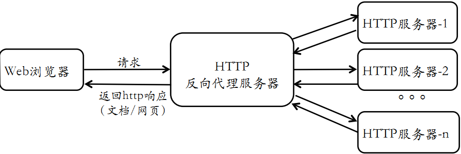

####  3.1.2.3 HTTP 代理的应用

所有现代的 Web 浏览器都允许用户对代理的使用进行配置。实际上，很多浏览器都提供了多种配置代理的方式，其中包括以下几种。

1.  手工配置。显式地设置要使用的代理。
2.  自动检测设置。对于微软的 IE 浏览器，实际是使用 WPAD (Web Proxy Auto Discovery) 协议来自动发现局域网中可用的代理服务器，并能自动将发现的代理服务器设置为当前浏览器的代理服务器。
3.  使用自动配置脚本（PAC）。提供一个 URL ，指向一个网络中的或本地的代理自动配置文件，该配置文件定义了不同的 URL 该使用哪个代理服务器或是直接连接方式。

以下以 Windows 系统上的 IE 浏览器为例，介绍手工配置：

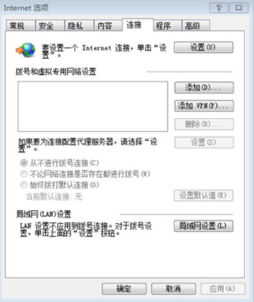

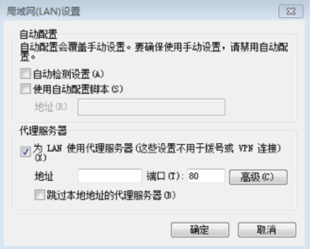

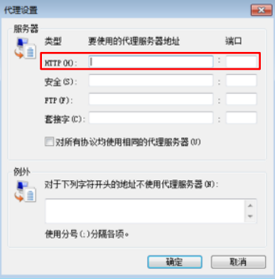

HTTP 代理的应用场景和前述典型代理服务一致，例如：

1. 某些网站使用 IP 黑名单方式导致浏览器直接连接无法访问，使用不在网站黑名单上的代理服务器再访问时就可以成功。
2. 优化 Web 站点访问速度，加速网页下载。
3. 内容审查，一旦发现恶意内容立即加以过滤和阻止。

HTTP 反向代理的代表：

1.  内网对外网服务的堡垒主机，即负载均衡和缓冲。
2.  内容小偷网站，黑帽 SEO（采用各种作弊手段来提高小偷网站在搜索引擎的排名）。

####  3.1.2.4 HTTP 代理的工作模式

1. X-Forwarded-For (XFF)
    X-Forwarded-For (XFF) 是用来识别通过 HTTP 代理或负载均衡方式连接到 Web 服务器的客户端最原始的 IP 地址的 HTTP 请求头字段。
    Squid 缓存代理服务器的开发人员最早引入了这一 HTTP 头字段，并由 IETF 在 Forwarded-For HTTP 头字段标准化草案中正式提出。标识用户的真实 IP。它的 HTTP 头一般格式如下:

    X-Forwarded-For: client1, proxy1, proxy2, proxy3

    其中的值通过一个逗号+空格把多个IP地址区分开,最左边 (client1) 是最原始客户端的 IP 地址,代理服务器每成功收到一个请求，就把请求来源 IP 地址添加到右边。在上面这个例子中，这个请求成功通过了三台代理服务器： proxy1 , proxy2 及 proxy3。请求由 client1 发出，到达了 proxy3 (proxy3 可能是请求的终点)。请求刚从 client1 中发出时，XFF 是空的，请求被发往 proxy1 ；通过 proxy1 的时候，client1 被添加到 XFF 中，之后请求被发往 proxy2 ;通过 proxy2 的时候，proxy1 被添加到 XFF 中，之后请求被发往 proxy3；通过 proxy3 时，proxy2 被添加到 XFF 中，之后请求的的去向不明，如果 proxy3 不是请求终点，请求会被继续转发。

2. 匿名代理
    不提供 X-Forwarded-For 字段，所有通过代理服务器的连接只会显示代理服务器的 IP 地址(而非连接发起的原始 IP 地址)，这样的代理服务器实际上充当了匿名服务提供者的角色，如果连接的原始 IP 地址不可得，恶意访问的检测与预防的难度将大大增加。

3. 非匿名代理
    即提供不提供 X-Forwarded-For 字段，可获得连接发起的原始 IP 地址。
    在实际应用中 HTTP 代理类型下表所示，其中高匿名代理甚至无法判断是否使用到代理服务。下面的表格总结了使用 PHP 语言编写客户端使用的代理服务器类型的基本方法：

|            | REMOTE_ADDR          | HTTP_VIA                   | HTTP_X_FORWARDED_FOR                          |
| :-         | :-                   | :-                         | :-                                            |
| 透明代理   | 最后一个代理服务器IP | 代理服务器IP或内部代理别名 | 客户端真实IP，或（经过多个代理时）遵循XFF标准 |
| 普通匿名   | 最后一个代理服务器IP | 代理服务器IP或内部代理别名 | 部分遵循XFF标准（隐藏客户端真实IP）           |
| 欺骗代理   | 代理服务器IP         | 代理服务器IP或内部代理别名 | 伪造经过的代理服务器IP列表                    |
| 高匿名代理 | 代理服务器IP         | 无数值或不显示             | 无数值或不显示                                |

以上表格中出现的 Via 字段是 HTTP 协议规范中定义的用于标识客户端请求经过了什么类型的代理服务器。除此之外，还有一些常见的非协议标准的 HTTP 请求头可能被代理服务器设置用来标识该请求是经过代理服务器转发的，例如：X-Forwarded-Host、X-Forwarded-Proto 等。

####  3.1.2.5 HSTS - HTTP Strict Transport Security

HSTS 是一种 Web 安全策略机制，要求客户端和服务器之间的所有通信流量必须使用 HTTPS，服务器通过实现 HSTS 机制，对于支持 HSTS 的客户端来说，可以达到强制客户端进行 SSL 证书合法性校验、强制使用 HTTPS 访问的效果，可有效地防止中间人攻击，而非授权替换行为也将被浏览器主动制止。

###  3.1.3 虚拟专用网（VPN）

####  3.1.3.1 虚拟专用网的简介

VPN 是企业网在因特网等公共网络的延伸，我们可以把它理解成是虚拟出来的企业内部专线。它可以通过特殊的加密的通讯协议，在连接在 Internet 上位于不同地方的两个或多个企业内部网之间建立一条专有的通讯线路，就好比是架设了一条专线一样，但是它并不需要真正的去铺设光缆之类的物理线路。VPN 的核心就是在利用公共网络建立虚拟私有网。

VPN 通过一个公用网络（通常是因特网）建立一个临时的、安全的连接，是一条穿过混乱的公用网络的安全、稳定的隧道。

####  3.1.3.2 VPN 的应用与类型

VPN 的主要用途有：

1. 保障通信过程的机密性和完整性，即在传输过程中可对数据进行加密，并在数据通信的接受端具有对接受到的数据进行数据包完整性的校验功能。

2. 实现自主可控的网络专用通信网。使局域网的拓扑延伸到互联网上的任意一个终端，这也是一种远程访问局域网资源的可行技术手段，相比较于物理链路专用的通信网解决方案成本更低。

按应用类型，VPN 可分为 3 种：拨号 VPN(Access VPN)、内部网 VPN(Intranet VPN)、外联网 VPN(Extranet VPN)；而按实现的层次分类有：二层隧道 VPN、三层隧道 VPN 、应用层隧道 VPN：SSL VPN。

Access VPN 又称为拨号 VPN，即 VPDN（Virtual Private Dial Network）是基于拨号用户的虚拟专用拨号网业务。即以拨号接入方式上网，是企业员工或企业的小分支机构通过公网远程和拨号的方式构筑的虚拟网。其具体实现是采用隧道技术，同时涉及模拟、拨号、ISDN、数字用户线路(XDSL)、移动 IP 和电缆技术。其原理是用户通过本地的 ISP 登录到因特网上，并在现在的办公室和公司内部网之间建立一条加密通道。如下图：

Access VPN 可减少用于相关的调制解调器和终端服务设备的资金及费用，简化网络；进而显著降低远距离通信的费用；拥有极大的可扩展性，可简便的对加入网络的新用户进行调度；除此之外还可以远端验证拨号用户服务基于标准，是基于策略功能的安全服务。如下图：

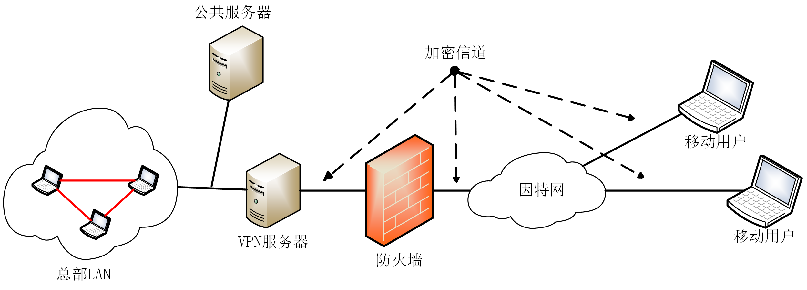

Intranet VPN 又称内部网 VPN，是企业的总部与分支机构间通过公网构筑的虚拟网。Intranet VPN 的优点是可以减少 WAN 带宽的费用；拓扑结构的形式也非常灵活；同时新的站点能更快，更容易的被连接；而通过设备供应商 WAN 的连接冗余，能够延长网络的可用时间。其结构如下图所示：

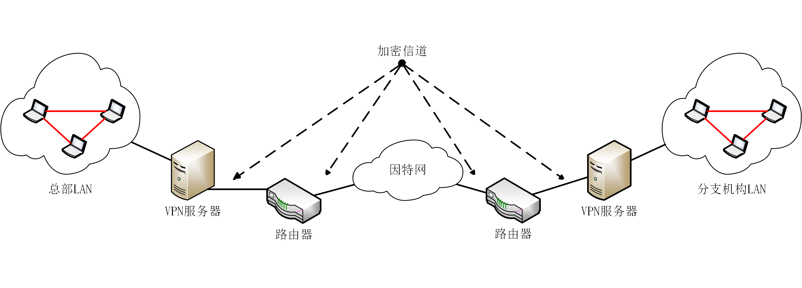

Extranet VPN 又称外联网 VPN ，是当企业间发生收购、兼并或企业间建立战略联盟时，使不同企业网通过公网来构筑的虚拟网。能够容易的对外部网进行部署和管理，外部网的连接可以使用与部署内部网和远端访问 VPN 相同的架构和协议进行部署，主要的不同是接入许可，外部网的用户被许可只有一次机会连接到其合作人的网络。其结构如下图所示：

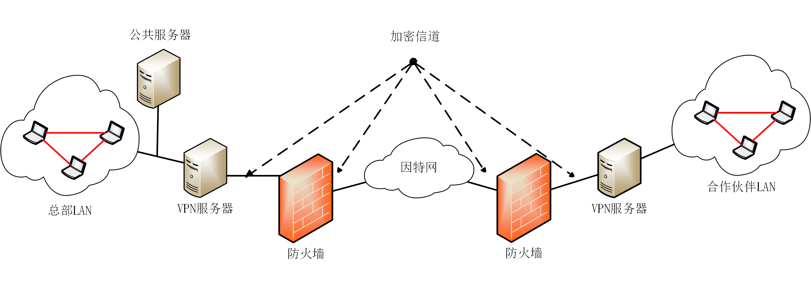

二层隧道协议有：

* L2TP: Layer 2 Tunnel Protocol (RFC 2661)
* PPTP: Point To Point Tunnel Protocol
* L2F（Layer 2 Forwarding）

三层隧道协议有：

* GRE: General Routing Encapsulation
* IPSec: IP Security Protocol

GRE 是对某些网络层协议（如：IP，IPX，AppleTalk 等）的数据报进行封装，使这些被封装的数据报能够在另一个网络层协议中传输，它提供了将一种协议的报文封装在另一种协议报文中的机制，使报文能够在异种网络中传输，异种报文传输的通道称为隧道（Tunnel）。

IPSec 是 IETF 制定的为保证在 Internet 上传送数据的安全保密性能的框架协议，包括报文验证头协议 AH（协议号51）和报文安全封装协议 ESP（协议号50）两个协议。IPSec 有隧道和转发（Transport）两种工作方式。

最后是应用层隧道协议: SSL VPN。提供安全的，远程企业访问资源，由一个或多个 VPN 设备组成，Web 浏览器和 SSL VPN 设备间的通信使用 SSL 协议进行加密，可使远程用户对 Web 应用程序和客户机/服务器应用程序进行访问，并可链接到内部网络。具有通用性和易用性。它的安全性与 IPSEC VPN 相当，并且支持访问控制。其易用性体现在客户端基本零配置，只需要有支持 ssl 的浏览器即可，非常适合远程用户访问企业内部网。但由于 SSL VPN 仅支持 Web 应用，故而具有局限性。

####  3.1.3.3 VPN 的设计原则

关于 VPN 的设计我们主要从以下三个方面进行考虑：

1.  安全性。包括隧道与加密、数据验证、用户验证和防火墙与攻击检测。

2.  可靠性。

3.  经济性与扩展性。

下面列出一些主流 VPN 协议，可进行比较。

<table>
   <tr>
      <td></td>
      <td>PPTP</td>
      <td>L2TP/IPSec</td>
      <td>OPENVPN</td>
   </tr>
   <tr>
      <td>背景</td>
      <td>基于PPP的基本VPN协议  
          微软平台上最早支持的VPN协议  
          默认未考虑加密或认证问题 </td>
      <td>RFC3193及相关RFC标准</td>
      <td>开源VPN解决方案</td>
   </tr>
   <tr>
      <td>数据加密</td>
      <td>PPP负载使用微软点到点加密协议（MPPE）
          MPPE实现RSA RC4加密算法
          最大支持128bit密钥</td>
      <td> L2TP负载使用标准IPSec协议加密
           RFC 4835规定使用3DES或者AES加密算法</td>
      <td>使用OpenSSL加密库 支持3DES、AES、RC5、Blowfish等多种加密算法</td>
   </tr>
   <tr>
      <td>速度</td>
      <td>使用128bit密钥加密时性能略高于使用256bit密钥加密</td>
      <td>数据封装2次，导致性能下降</td>
      <td>UDP模式下性能达到最佳</td>
   </tr>
   <tr>
      <td>安全漏洞</td>
      <td>微软的PPTP实现有严重安全漏洞
          MSCHAP-v2容易遭受基于字典的暴力破解
          RC4加密算法容易遭受比特位翻转攻击</td>
      <td>严重漏洞少
          配合使用高强度加密算法（如AES-GCM）时安全性较高</td>
      <td>严重漏洞少
          配合使用高强度加密算法（如AES-GCM）时安全性较高</td>
   </tr>
   <tr>
      <td>客户端兼容性</td>
      <td>全平台</td>
      <td>全平台</td>
      <td>全平台</td>
   </tr>
   <tr>
      <td>综合评分</td>
      <td>★☆☆☆☆</td>
      <td>★★★★☆</td>
      <td>★★★★★</td>
   </tr>
</table>

### 3.1.4 SOCKS 代理

SOCKS 是一种网络传输协议，主要用于客户端与服务器间通讯的中间传递。而 SOCKS 代理经常用于电子邮件、新闻组软件、网络传呼 ICQ 、网络聊天 QQ ，或使用代理服务器联众打游戏。图 3-10 为 SOCKS 代理原理图。

###  3.1.5 小结

以上单元介绍了常见的代理服务 VPN 、SOCKS 代理和 HTTP 代理，一般情况下它们的安全性可排序为：VPN &gt; SOCKS 代理 &gt;HTTP 代理；其次在使用开放代理时必须谨慎，避免敏感数据被嗅探和避免重要数据被篡改。下面开始介绍高级代理服务。

## 3.2 高级代理服务

###  3.2.1 匿名基本概念

匿名的定义是—个对象在一组对象的集合（即匿名集合，Anonymity Set）中不可识别的状态。匿名集合，指发生某个行为（如发送一封电子邮件或者访问某个网站）的可能实体（如用户）的集合，匿名集的概念是研究匿名技术的基础。

匿名行为是指借助于其他实体的行为来隐藏自己的行为，匿名集合越大，分布越均匀，匿名性就越强。

不可关联性，两个或多个对象（如实体、消息、事件、行为等）之间的不可关联性是指系统中的这些对象，相对于其先验知识的关联性来说，其关联性没有发生变化。攻击发生前后，对象可被关联的概率保持不变。

不可观察性，即不能从发送或接收事件集合中分辨出某个发送或接收的事件。

假名，对象使用假名作为其身份标识，假名与对象之间具有不可关联性，是实现匿名的一种方法，使用不变的假名可以建立问责制和声誉机制，防止匿名系统被滥用。

###  3.2.2 匿名通信

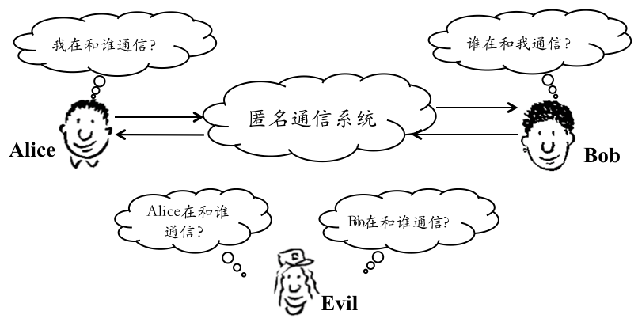

网络中通信的实体可以分为发送者（sender）和接收者（recipient），通信的内容称之为消息（message）。传统意义上我们更多地研究的是通信内容的保密和安全问题，即消息的保密性、完整性、可用性、可控性和不可否认性。匿名问题考虑的是发送者和接收者的身份信息也是机密的情况，一个匿名系统的攻击者（attacker）希望得到的是“谁和谁”在通信，甚至要控制或破坏通信过程。如下图所示：

匿名通信（anonymous
communication）：是指通过一定的方法将业务流中的通信实体的网络地址、实体间的通信关系等隐私信息加以隐藏，使攻击者无从直接获知或推知双方的通信关系或通信的一方。如图2.1 ，在发送者 Alice 与接收者 Bob 的通信中，如果 Bob 并不知道 Alice 的身份，并且第三方观察者 Eve 并不能把 Alice 和 Bob 关联起来，则称 Alice 匿名地与 Bob 通信。有时允许 Bob 知道 Alice 的身份，但 Alice 和 Bob 都会对 Eve 隐藏他们之间的通信。

而根据通信过程中受保护角色的不同，通信系统中的匿名保护通常可以分为如下三种形式：

1. 发送者匿名（sender anonymity），保护通信发起者的身份标识；
2. 接收者匿名（receiver anonymity），保护通信响应者的身份标识；
3. 收发双方无关联（unlinkability of sender and receiver），又称为通信关系匿名（communication relationship anonymity），保护通信关系不被攻击者观测到，使发送者和接收者无法被关联起来。发送者匿名或接收者匿名的情况下一定是通信关系匿名的，但是通信关系匿名的前提下发送者或接收者不一定是匿名的。例如在某些情况下虽然发送者与接收者之间的通信关系是匿名的，但是通信双方却知道对方的身份。这三种类型的匿名在实际系统中都有应用，在 Web 匿名浏览中，要求发送者向 Web 服务器发送浏览请求时保持发送者匿名；在匿名电子邮件中要求获得发送者匿名和通信关系不可关联；在匿名选举系统中，要求选举者与投票者是不可关联的并且发送者是匿名的；有些匿名要求在组播应用环境中，例如匿名心理座谈中，很多人加入一个组进行咨询或收听讲座，由于心理咨询涉及到一些个人隐私问题，所以参与座谈者要求保持匿名参加，需要保证发送者匿名和接收者匿名。

在匿名通信中所面临的技术性攻击有：

1. 流量形状攻击

    主要包括通信模式攻击、消息频度攻击和报文计数攻击。通信模式攻击主要针对实时交互式的应用。在这种应用中，通常只有一个用户发送消息而另外一个用户沉默接收消息。长时间对报文发送与接收的时间进行分析，有可能发现通信双方的对应关系。消息频度与计数的攻击则是建立在对发送接收数据报文的比较上。

2. 交集攻击

    基于长时间对用户网络行为的观察。对于一个特定的网络用户来说，通常登录时间、交互对象等具有一定的规律，因此，通过对不同时间不同活动的网络用户进行交集分析，有可能确定对应关系。但这种攻击是脆弱的，其代价也会随着网络规模的增大而增大。

3. 重放攻击

    所谓重放攻击，指的是攻击者首先记录下待追踪的消息，然后再重新将此消息发送进入 MIX 网络以追踪特定消息传输路径的一种攻击。

4. 刷新攻击

    是针对 MIX 的主动攻击中最为有效的一种攻击。攻击者通过消息延迟或发送虚假消息等方法将待攻击 MIX 的内部缓冲区清空，然后将待追踪消息与其他攻击者的虚假消息一起发送给MIX服务器。当 MIX 服务器输出消息时，只有一条消息对于攻击者是未知的，则攻击者可以确认这条消息就是待追踪消息。

5. 时间攻击

    基本思想是攻击者利用消息进入离开服务器的时间信息来关联消息。

### 3.2.3 匿名通信的实现

1) 代理方法

代理通过修改消息的源地址向消息的接收者隐藏发送者的身份信息（这里指 IP 地址）。包括匿名代理、假名代理、MIX 增强匿名代理。代理方法的优点是发送方匿名的协议简单，具有高效性。但在安全性上有明显不足，比如用户身份对代理来说不是保密的，因此要求代理必须是可信任的；而采用单点代理实现方法容易遭到攻击者的控制和跟踪，同时因为用户接入匿名或假名代理采是用明文形式，使得攻击者易于进行流量分析；并且匿名代理需要做过滤操作，这易于成为系统瓶颈。

2) MIX-NET

MIX 节点接收一定数量的消息，通过加密或填充等手段修改消息的外观，通过延迟或重排序等手段来修改消息的顺序，从而以一种隐藏输入输出对应关系的方式输出消息，保证攻击者无法准确推断通信参与者的通信关系。多台 MIX 服务器可以以级联或网络的形式进行连接，在消息报文通过的一组 MIX 服务器中，只要有一台服务器正常工作，就可以保证系统的匿名性。

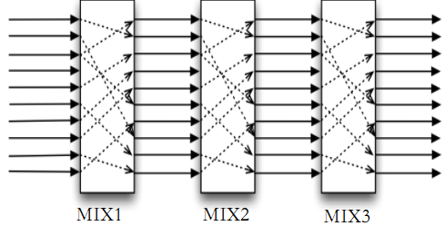

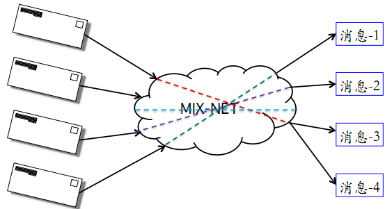

3) Crowds

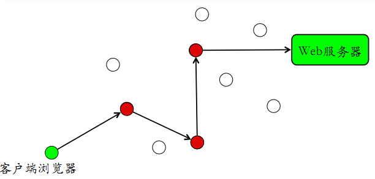

4) Tarzan

Tarzan 在英文中的意思为“泰山”，Tarzan 是一个 P2P 的匿名 IP 叠加网络，它通过数据多层加密和消息多跳路由来实现匿名性。它将 mix-net 的匿名方法扩展到 P2P 环境中，结点之间通过中继结点序列（这一序列结点构成一条隧道）来通信。提供的匿名机制有：发送者匿名、接收者匿名、关系匿名。

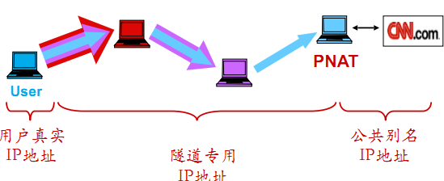

5) 洋葱路由（Onion-Routing）

与基于消息的匿名通信系统不同，Onion-Routing 系统中是采用通道方式构建匿名路径。即消息传输前需要先发送控制消息建立通道，此后的消息传输均按照同一路径传输，在消息传输结束后拆除通道。Onion-Routing 系统于 2000 年 1 月关闭。Tor 又称为新一代 Onion-Routing 系统，是在 7 层协议栈中的应用层进行加密。它支持延迟敏感的 Web 浏览、即时通信、IRC、SSH 等应用。用户通过在本机运行一个洋葱代理服务器，这个代理周期性地与其他 Tor 交流，从而在 Tor 网络中构成虚拟环路。而每个（洋葱）路由器间的传输都经过对称密钥来加密，形成有层次的结构。

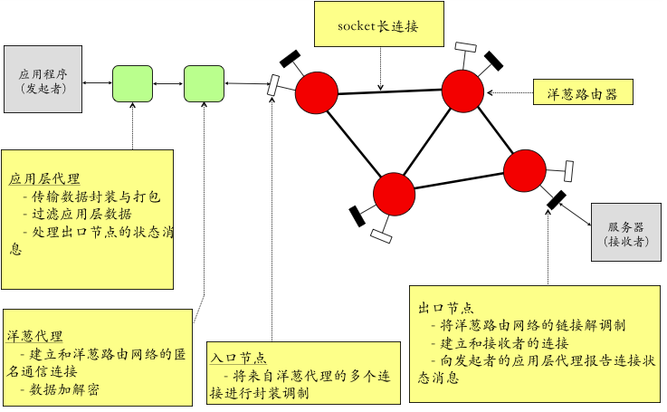

洋葱路由（Onion routing），是一个通用可用于如 Internet 开放式网络上的匿名通信体系，通过适当的代理支持多类的应用如：HTTP,FTP,SMTP。其中应用数据通过动态建立的匿名连接传输，具有分布式，容错，安全等特性。其总体架构如下图所示：

洋葱路由在邻居路由器间长期保持 socket 连接，每个连接上的两邻居采用两个 DES 加密 key ，每个方向一个确保通信安全。多个匿名连接可以复用在一个连接上，这时每个匿名连接分配一个 ACI 标识（局部性的标识）。其消息类似 ATM 传输，分成 48 bytes 定长信元，使用 DES 加密。传输中来自不同连接的信元 mix 复用，但需保持连接有序。

使用洋葱路由，网络来源的标志可进行伪造。这说明根据 IP 地址识别或根据路由识别都是不可靠的，但也并不意味着多种代理技术的混合应用就可以逃避网络安全的审计。网络安全对抗的复杂性在匿名技术中再次放大，而面对网络安全，我们切不可报以侥幸心理。

## 3.3 代理服务的检测

###  3.3.1 检测的需求与手段

代理服务的检测包含有网络流量计费，用以避免计费误差和损失；网络安全审计，以打击网络攻击源头；还有网络滥用，以打击网络滥用源头。其检测手段可分为检测静态特征（协议关键字）和检测动态特征（流量统计特征）。

静态特征方法包括端口扫描；协议字段变量特征，即网络数据报文的头部字段和负载数据。其中端口扫描方式主要适用于对代理服务器的检测。代理服务器一般最为常用的端口有 8080/3218 等，可以通过扫描这些端口获得。对于采用非常用端口的代理服务器，端口扫描

方式的效率则很低，准确性也差。

动态特征即协议的行为特征，有流量形状攻击，其中又包括通信模式攻击、消息频度攻击、报文计数攻击；交集攻击；重放攻击；刷新攻击；时间攻击。

代理检测方法的效果取决于检测方所拥有的资源多少、权限大小。

###  3.3.2 代理服务检测示例

首先设置浏览器使用 HTTP 代理，然后伪造 HTTP 请求头，将 X-Forwarded-For 设置单个、多个 IP 地址或 X-Forwarded-For 设置为任意字符。进行洋葱路由匿名代理服务的检测，利用 cookie 机制。要小心 remote\_host 字段泄漏：你正在使用 tor！ 并且当心浏览器的“标识”泄漏你的真实身份，例如浏览器 cookie、Flash Shared Object （flash cookie）、HTML5 本地存储。

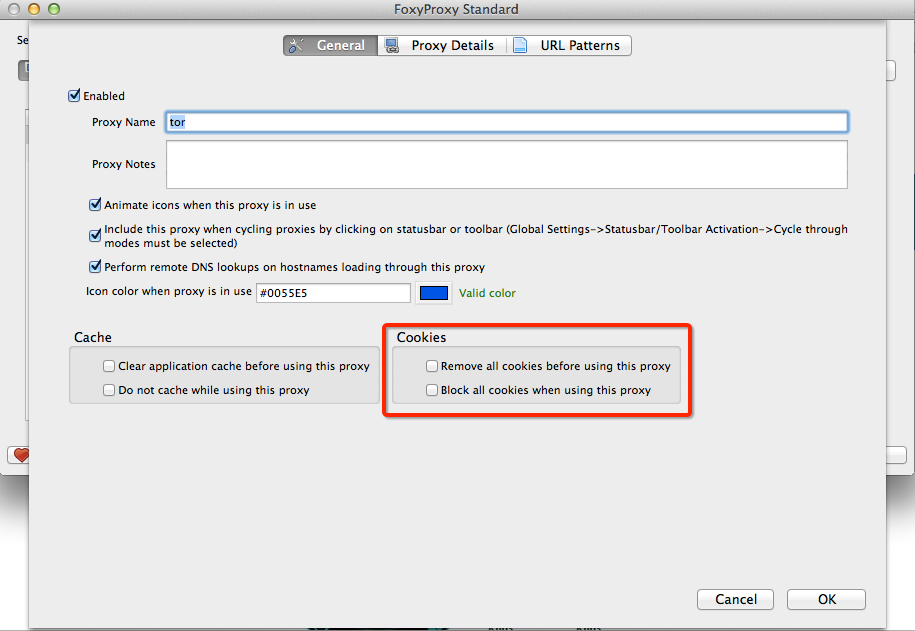

## 3.4 课后习题

1. 代理技术在网络攻防中的意义？

    (1) 对攻方的意义？
    (2) 对守方的意义？

2.  常规代理技术和高级代理技术的设计思想区别与联系？
